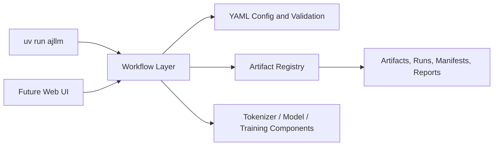

# ajLLM

ajLLM is a configurable, from-scratch toolkit for training byte-level BPE tokenizers and decoder-only Transformer language models. It covers the complete local workflow:

- train a byte-level BPE tokenizer;
- encode large UTF-8 corpora into memory-mappable `uint32` token files;
- train and resume configurable Transformer language models;
- evaluate cross-entropy and perplexity;
- run and compare learning-rate or architecture sweeps;
- generate text from a selected training run;
- generate Markdown model architecture, tensor-shape, and parameter reports.


## Design



The workflow layer is intentional: a future page can call the same Python functions as the CLI instead of duplicating training, evaluation, or generation logic.

## Directory Layout

```text
ajllm_project/
├── src/ajllm/
│   ├── config/             # YAML loading, inheritance, validation
│   ├── tokenization/       # BPE training, encoding, serialization
│   ├── modeling/           # Layers, attention, Transformer, factory
│   ├── training/           # Data, loss, AdamW, schedule, trainer
│   ├── generation/         # Sampling and autoregressive generation
│   ├── evaluation/         # Perplexity, comparisons, plots
│   ├── workflows/          # Complete user-facing operations
│   ├── artifacts/          # Manifests, registry, path conventions
│   ├── reporting/          # Markdown model reports
│   └── cli.py              # Unified command-line entry point
├── configs/
│   ├── datasets/           # Reusable dataset definitions
│   ├── tokenizers/         # Reusable tokenizer definitions
│   ├── models/             # Reusable model architectures
│   └── runs/               # Directly runnable task configurations
├── data/
│   ├── raw/                # Local raw datasets, ignored by Git
│   └── prompts/            # Generation prompts
├── artifacts/
│   ├── tokenizers/         # vocab.json, merges.txt, manifest.json
│   └── encoded/            # uint32 files grouped by dataset/tokenizer
├── runs/
│   ├── training/           # Logs, checkpoints, reports, resolved config
│   ├── sweeps/             # Trials, comparison CSV, plots
│   ├── evaluations/        # Evaluation results
│   ├── comparisons/        # Multi-run comparisons
│   └── generations/        # Generated text and parameters
├── docs/
└── tests/
    ├── unit/
    ├── integration/
    ├── e2e/
    └── fixtures/
```

## Setup

Install [uv](https://docs.astral.sh/uv/) and run:

```bash
cd ajllm_project
uv sync --extra dev
uv run ajllm --help
uv run pytest
```

All examples below are executed from the `ajllm_project` root.

## Dataset and Prebuilt Artifact Setup

The dataset definitions expect the following local paths:

```text
data/raw/tinystories/train.txt
data/raw/tinystories/validation.txt
data/raw/openwebtext/train.txt
data/raw/openwebtext/validation.txt
```

Download the TinyStories V2 GPT-4 text files with:

```bash
mkdir -p data/raw/tinystories
wget -O data/raw/tinystories/train.txt \
  https://huggingface.co/datasets/roneneldan/TinyStories/resolve/main/TinyStoriesV2-GPT4-train.txt
wget -O data/raw/tinystories/validation.txt \
  https://huggingface.co/datasets/roneneldan/TinyStories/resolve/main/TinyStoriesV2-GPT4-valid.txt
```

Download and unpack the OpenWebText sample with:

```bash
mkdir -p data/raw/openwebtext
wget -O data/raw/openwebtext/train.txt.gz \
  https://huggingface.co/datasets/stanford-cs336/owt-sample/resolve/main/owt_train.txt.gz
gunzip -f data/raw/openwebtext/train.txt.gz
wget -O data/raw/openwebtext/validation.txt.gz \
  https://huggingface.co/datasets/stanford-cs336/owt-sample/resolve/main/owt_valid.txt.gz
gunzip -f data/raw/openwebtext/validation.txt.gz
```

The raw text files are only required when training a tokenizer or re-encoding a dataset. For LM training, you can download the prebuilt tokenizer and encoded-token artifacts from the [Huangshj/cs336 dataset repository](https://huggingface.co/datasets/Huangshj/cs336/tree/main). The repository contains matching `tokenizers/` and `encoded/` directories, including vocabulary files, merge tables, `uint32` token files, and manifests.

From the project root, use the Hugging Face CLI to place them directly under `artifacts/`:

```bash
hf download Huangshj/cs336 \
  --repo-type dataset \
  --include "tokenizers/*" \
  --include "encoded/*" \
  --local-dir .
```

If the `hf` command is unavailable, install it with `uv tool install huggingface-hub`, or download the two directories from the repository page and copy them into `artifacts/` while preserving their directory structure.

After downloading, the relevant artifact directories should look like:

```text
artifacts/tokenizers/tinystories_bpe_10k/
  vocab.json  merges.txt  manifest.json
artifacts/tokenizers/openwebtext_bpe_32k/
  vocab.json  merges.txt  manifest.json
artifacts/encoded/tinystories/tinystories_bpe_10k/
  train.uint32  validation.uint32  manifest.json
artifacts/encoded/openwebtext/openwebtext_bpe_32k/
  train.uint32  validation.uint32  manifest.json
```

The tokenizer fingerprints in the encoded manifests must match the selected tokenizer manifests. The included LM configs already reference these names, so no tokenizer training or encoding is needed when the prebuilt artifacts are present.

If you prefer to reproduce the artifacts, first download the raw text above, then run:

```bash
uv run ajllm tokenizer train \
  --config configs/runs/tokenizer_train/tinystories_bpe_10k.yaml
uv run ajllm tokenizer encode \
  --config configs/runs/tokenizer_encode/tinystories.yaml

uv run ajllm tokenizer train \
  --config configs/runs/tokenizer_train/openwebtext_bpe_32k.yaml
uv run ajllm tokenizer encode \
  --config configs/runs/tokenizer_encode/openwebtext.yaml
```

The default OpenWebText encoding uses the lossless `byte_fallback` strategy for malformed, unusually long pre-tokens. Sections 1 and 2 describe the tokenizer training and encoding settings in detail.

## Configuration Model

Reusable component configs live in three catalogs:

```text
configs/datasets/tinystories.yaml
configs/tokenizers/tinystories_bpe_10k.yaml
configs/models/transformer_baseline.yaml
```

Runnable configs reference those components by name:

```yaml
experiment: tinystories_baseline
dataset: tinystories
tokenizer: tinystories_bpe_10k
model: transformer_baseline

training:
  batch_size: 64
  total_tokens: 327680000

optimizer:
  max_lr: 1.0e-3
  min_lr_ratio: 0.1
```

The loader resolves component names, applies optional `base` inheritance, validates combinations, and stores the resulting `resolved_config.yaml` with every run.

The model vocabulary size is derived from the tokenizer manifest. It is not manually duplicated in model or training configs.

## Quick Smoke Test

The repository includes a small corpus and tiny model configuration:

```bash
uv run ajllm tokenizer train  --config configs/runs/tokenizer_train/debug.yaml
uv run ajllm tokenizer encode --config configs/runs/tokenizer_encode/debug.yaml
uv run ajllm lm train         --config configs/runs/lm_train/debug.yaml
```

The final command prints the newly created training run directory. Put that path into the example evaluation or generation config before running downstream commands.

Before the progress bar, LM training prints a setup summary containing the selected device,
train/validation token counts, batch size, context length, tokens per batch, configured training
steps, and an approximate number of batches in one full dataset pass. The training loop uses
random windows rather than epoch-based iteration, so `training batches (steps)` is the exact
number of optimizer updates.

## 1. Train a Tokenizer

Dataset definition:

```yaml
# configs/datasets/tinystories.yaml
name: tinystories
splits:
  train: data/raw/tinystories/train.txt
  validation: data/raw/tinystories/validation.txt
```

Tokenizer definition:

```yaml
# configs/tokenizers/tinystories_bpe_10k.yaml
name: tinystories_bpe_10k
vocab_size: 10000
special_tokens:
  - <|endoftext|>
pretokenization:
  parallel: true
  num_processes: null       # null means all available CPU cores
  chunk_size_bytes: 8388608
```

Run:

```bash
uv run ajllm tokenizer train \
  --config configs/runs/tokenizer_train/tinystories_bpe_10k.yaml
```

Output:

```text
artifacts/tokenizers/tinystories_bpe_10k/
├── vocab.json
├── merges.txt
├── resolved_config.yaml
└── manifest.json
```

The manifest records source information, special tokens, merge count, file hashes, and a stable tokenizer fingerprint.

When `pretokenization.parallel` is enabled, the corpus is split at special-token document boundaries and counted by multiple worker processes. Set `parallel: false` for a deterministic single-process debug run.

## 2. Encode a Dataset

```bash
uv run ajllm tokenizer encode \
  --config configs/runs/tokenizer_encode/tinystories.yaml
```

Encoding also supports process-based chunking. Its `encoding` section controls `parallel`, `num_processes`, `chunk_size`, and `buffer_tokens`. Worker outputs are concatenated in chunk order, so parallel encoding preserves the token-file order.

Very long GPT-style pre-tokens can make the naive BPE merge loop quadratic (OpenWebText contains a few malformed repeated-byte spans). File encoding therefore defaults to a lossless byte fallback for pre-tokens longer than 8,192 UTF-8 bytes:

```yaml
encoding:
  max_pretoken_bytes: 8192
  long_pretoken_strategy: byte_fallback  # byte_fallback, bpe, or error
```

`byte_fallback` emits the original UTF-8 bytes as the base byte tokens, so decoding remains identical while avoiding the expensive merge loop. Each encoded split records `fallback_pretoken_count`, `fallback_bytes`, and `largest_pretoken_bytes` in `manifest.json`. Use `bpe` with `max_pretoken_bytes: null` only when you intentionally want the unbounded merge behavior.

Output:

```text
artifacts/encoded/tinystories/tinystories_bpe_10k/
├── train.uint32
├── validation.uint32
├── resolved_config.yaml
└── manifest.json
```

Encoding is streamed with bounded memory. The manifest associates each token file with the exact tokenizer fingerprint, token count, source path, size, and SHA-256 hash.

## 3. Train a Language Model

```bash
uv run ajllm lm train \
  --config configs/runs/lm_train/tinystories_baseline.yaml
```

`runtime.device` accepts `auto`, `cpu`, `cuda`, or `mps`. With `auto`, ajLLM selects CUDA first,
then Apple MPS, and finally CPU. If the setup summary says `CPU-only wheel`, the installed
PyTorch package has no CUDA runtime (`torch.version.cuda` is `None`), even if an NVIDIA GPU and
driver are installed. The repository configures the CUDA index above; if you change the Torch
version or CUDA variant, update `pytorch-cu130` in `pyproject.toml`, then run `uv lock` and
`uv sync`. Verify with:

```bash
uv run python -c "import torch; print(torch.__version__, torch.version.cuda, torch.cuda.is_available())"
```

For a strict GPU run, set `runtime.device: cuda`; this raises an error instead of silently
falling back to CPU when CUDA is unavailable.

Training output is grouped by the selected components:

```text
runs/training/<dataset>/<tokenizer>/<model>/<experiment>/<run_id>/
├── resolved_config.yaml
├── manifest.json
├── metrics.jsonl
├── summary.json
├── model_report.md
└── checkpoints/
    ├── best.pt
    ├── latest.pt
    ├── final.pt
    └── step_*.pt
```

To resume, add the checkpoint path to the training config:

```yaml
training:
  resume_from: runs/training/.../checkpoints/latest.pt
```

The checkpoint restores both model and optimizer state and continues from its saved step.

## 4. Learning-Rate Sweep

Sweeps inherit a base training config and only state changed values:

```yaml
base: ../lm_train/tinystories_baseline.yaml
name: tinystories_lr

grid:
  optimizer.max_lr:
    - 1.0e-4
    - 5.0e-4
    - 1.0e-3
    - 5.0e-3
    - 1.0e-2
    - 5.0e-2

comparison:
  metric: best_validation_loss
  mode: min
  generate_plot: true
```

Run:

```bash
uv run ajllm lm sweep \
  --config configs/runs/lm_sweep/tinystories_lr.yaml
```

Each grid combination receives an independent self-contained trial directory. The sweep output includes `comparison.csv`, `trials.json`, `learning_curves.png`, and the best run in its manifest.

The grid accepts any dotted configuration key, so it can also compare batch sizes, model dimensions, normalization placement, or feed-forward variants.

## 5. Evaluate Loss and Perplexity

```bash
uv run ajllm lm evaluate \
  --config configs/runs/lm_evaluate/tinystories_eval.yaml
```

`checkpoint` may be `best`, `latest`, `final`, or an explicit `.pt` path.

## 6. Compare Existing Runs

List completed run directories in `configs/runs/lm_compare/tinystories_lr.yaml`:

```bash
uv run ajllm lm compare \
  --config configs/runs/lm_compare/tinystories_lr.yaml
```

The command writes ranked JSON/CSV results and combined learning curves.

## 7. Generate Text

```bash
uv run ajllm lm generate \
  --config configs/runs/lm_generate/tinystories_gen.yaml
```

Generation recovers the model architecture and tokenizer from the training run. The generation config only controls the checkpoint, prompts, temperature, top-p, number of samples, device, and seed.

Prompts may be provided inline:

```yaml
prompts:
  - Once upon a time
  - The little robot looked at the stars
```

or loaded from `prompt_file` with one prompt per line.

## Model Architecture Options

```yaml
position_encoding:
  type: rope       # rope, learned, none
  theta: 10000

normalization:
  type: rmsnorm    # rmsnorm, none
  placement: pre   # pre, post

feed_forward:
  type: swiglu     # swiglu, silu

tie_embeddings: false
```

These fields directly control model construction, enabling real architecture ablations rather than config-only labels.

Generate a standalone report for a model component:

```bash
uv run ajllm model report \
  --config configs/models/transformer_baseline.yaml
```

The report contains a Mermaid diagram, configured values, module tensor shapes, a parameter formula, per-tensor parameter counts, and the instantiated total.

It also estimates training memory as:

```text
parameters + saved activations + parameter gradients + AdamW first/second moments
```

and reports matrix-only FLOPs for one forward iteration, one training iteration (approximately `3 × forward`), and the complete configured token budget. These are planning estimates, not CUDA peak-memory measurements; framework workspaces and allocator fragmentation are excluded.

For the included baseline (`V=10000`, `D=512`, `L=4`, `H=16`, `F=1344`):

```text
Input IDs:         [64, 256]
Embeddings:        [64, 256, 512]
Q/K/V per head:    [64, 16, 256, 32]
Attention scores:  [64, 16, 256, 256]
Logits:            [64, 256, 10000]

N = 2VD + L(4D² + 3DF + 2D) + D
  = 22,696,448 parameters
```

## Artifact Safety

Before LM training, ajLLM verifies that:

- the tokenizer artifact exists;
- the encoded dataset artifact exists;
- the encoded dataset tokenizer fingerprint matches the selected tokenizer;
- the vocabulary size is read from the artifact;
- model dimensions and attention-head divisibility are valid.

This prevents accidentally training on IDs produced by a different merge table or vocabulary.

## Tests

```bash
uv run pytest
```

The test suite is independent of the reference project:

- unit tests verify BPE round trips, serialization, model variants, loss, scheduler, and checkpoint restoration;
- integration tests execute tokenizer training, dataset encoding, LM training, and generation on a tiny corpus;
- CLI tests verify the unified command structure.

Source code uses concise English docstrings and comments. User-facing configuration and documentation remain straightforward to edit without changing Python code.

## More Documentation

- [Project architecture](docs/project_architecture.md)
- [Model architecture](docs/model_architecture.md)
- [Configuration](docs/configuration.md)
- [Workflows](docs/workflows.md)
