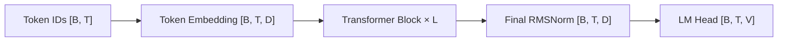

# Transformer Language Model



The default block is a pre-norm decoder block:

```text
h = x + CausalSelfAttention(RMSNorm(x))
y = h + SwiGLU(RMSNorm(h))
```

The implementation also supports post-norm, no normalization, SiLU feed-forward layers, RoPE, learned positional embeddings, no positional embedding, and tied token/output embeddings.

## Important Shapes

| Value | Shape |
|---|---|
| Token IDs | `[B, T]` |
| Hidden states | `[B, T, D]` |
| Q, K, V | `[B, H, T, D/H]` |
| Attention scores | `[B, H, T, T]` |
| SwiGLU hidden states | `[B, T, F]` |
| Logits | `[B, T, V]` |

For an untied pre-norm SwiGLU model without learned absolute positions:

```text
N = 2VD + L(4D² + 3DF + 2D) + D
```

For the included baseline configuration, `V=10000`, `D=512`, `L=4`, and `F=1344`, producing **22,696,448 parameters**. Every training run writes `model_report.md` using the actual resolved configuration and instantiated parameter tensors.

## Resource Planning

The generated report estimates memory as:

```text
parameter memory
+ saved activation memory
+ parameter-gradient memory
+ AdamW first and second moment memory
```

It estimates matrix FLOPs for attention projections, QKᵀ/AV products, feed-forward projections, and the LM head. Training is approximated as three forward-equivalent passes, then multiplied by the configured number of steps. CUDA workspace, kernel overhead, data-loader memory, and allocator fragmentation are excluded, so the result is intended for comparing configurations rather than predicting an exact peak allocation.
