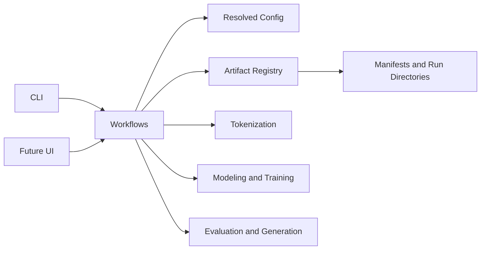

# Project Architecture

ajLLM separates reusable algorithms from application workflows and generated artifacts.

## Layers

- `tokenization`, `modeling`, `training`, and `generation` contain reusable implementations with no CLI concerns.
- `workflows` compose components into complete operations and are the integration surface for the CLI or a future UI.
- `config` resolves YAML inheritance and named dataset, tokenizer, and model components.
- `artifacts` creates stable paths and verifies lineage through manifests.
- `evaluation` and `reporting` turn runs into metrics, plots, and Markdown reports.

The reference project is not imported at runtime. Dataset configurations may point to existing corpus files outside this project, but every newly generated tokenizer, encoded dataset, checkpoint, and report belongs to ajLLM.

