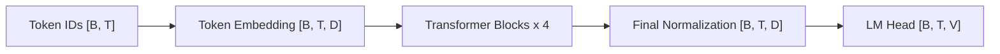

# Model Architecture: transformer_baseline

This report is generated from the resolved model configuration and instantiated model.



Each Transformer block contains causal multi-head self-attention and a feed-forward network
connected by residual paths. Normalization placement and position encoding are controlled by
the model configuration.

## Configured Dimensions

| Symbol | Meaning | Value |
|---|---|---:|
| B | Batch size | 64 |
| T | Context length | 256 |
| V | Vocabulary size | 10000 |
| D | Model width | 512 |
| L | Transformer layers | 4 |
| H | Attention heads | 16 |
| D/H | Head dimension | 32 |
| F | Feed-forward width | 1344 |

## Tensor Shapes

| Stage | Shape |
|---|---|
| Input token IDs | `[64, 256]` |
| Token embeddings | `[64, 256, 512]` |
| Q, K, V per head | `[64, 16, 256, 32]` |
| Attention scores | `[64, 16, 256, 256]` |
| Block output | `[64, 256, 512]` |
| LM logits | `[64, 256, 10000]` |

## Parameters

General formula for the selected architecture:

```text
N = 2VD + L(4D^2 + 3DF + 2D) + D
```

Instantiated parameter count: **22,696,448**.

| Parameter | Shape | Count |
|---|---|---:|
| `token_embeddings.weight` | `[10000, 512]` | 5,120,000 |
| `layers.0.norm1.weight` | `[512]` | 512 |
| `layers.0.norm2.weight` | `[512]` | 512 |
| `layers.0.attention.q_proj.weight` | `[512, 512]` | 262,144 |
| `layers.0.attention.k_proj.weight` | `[512, 512]` | 262,144 |
| `layers.0.attention.v_proj.weight` | `[512, 512]` | 262,144 |
| `layers.0.attention.output_proj.weight` | `[512, 512]` | 262,144 |
| `layers.0.feed_forward.w1.weight` | `[1344, 512]` | 688,128 |
| `layers.0.feed_forward.w2.weight` | `[512, 1344]` | 688,128 |
| `layers.0.feed_forward.w3.weight` | `[1344, 512]` | 688,128 |
| `layers.1.norm1.weight` | `[512]` | 512 |
| `layers.1.norm2.weight` | `[512]` | 512 |
| `layers.1.attention.q_proj.weight` | `[512, 512]` | 262,144 |
| `layers.1.attention.k_proj.weight` | `[512, 512]` | 262,144 |
| `layers.1.attention.v_proj.weight` | `[512, 512]` | 262,144 |
| `layers.1.attention.output_proj.weight` | `[512, 512]` | 262,144 |
| `layers.1.feed_forward.w1.weight` | `[1344, 512]` | 688,128 |
| `layers.1.feed_forward.w2.weight` | `[512, 1344]` | 688,128 |
| `layers.1.feed_forward.w3.weight` | `[1344, 512]` | 688,128 |
| `layers.2.norm1.weight` | `[512]` | 512 |
| `layers.2.norm2.weight` | `[512]` | 512 |
| `layers.2.attention.q_proj.weight` | `[512, 512]` | 262,144 |
| `layers.2.attention.k_proj.weight` | `[512, 512]` | 262,144 |
| `layers.2.attention.v_proj.weight` | `[512, 512]` | 262,144 |
| `layers.2.attention.output_proj.weight` | `[512, 512]` | 262,144 |
| `layers.2.feed_forward.w1.weight` | `[1344, 512]` | 688,128 |
| `layers.2.feed_forward.w2.weight` | `[512, 1344]` | 688,128 |
| `layers.2.feed_forward.w3.weight` | `[1344, 512]` | 688,128 |
| `layers.3.norm1.weight` | `[512]` | 512 |
| `layers.3.norm2.weight` | `[512]` | 512 |
| `layers.3.attention.q_proj.weight` | `[512, 512]` | 262,144 |
| `layers.3.attention.k_proj.weight` | `[512, 512]` | 262,144 |
| `layers.3.attention.v_proj.weight` | `[512, 512]` | 262,144 |
| `layers.3.attention.output_proj.weight` | `[512, 512]` | 262,144 |
| `layers.3.feed_forward.w1.weight` | `[1344, 512]` | 688,128 |
| `layers.3.feed_forward.w2.weight` | `[512, 1344]` | 688,128 |
| `layers.3.feed_forward.w3.weight` | `[1344, 512]` | 688,128 |
| `final_norm.weight` | `[512]` | 512 |
| `lm_head.weight` | `[10000, 512]` | 5,120,000 |

## Estimated Training Memory

| Component | Estimate |
|---|---:|
| Parameters | 90,785,792 bytes (86.580 MiB) |
| Saved activations (estimated) | 4,564,451,328 bytes (4.251 GiB) |
| Parameter gradients | 90,785,792 bytes (86.580 MiB) |
| AdamW first and second moments | 181,571,584 bytes (173.160 MiB) |
| Total estimated training memory | 4,927,594,496 bytes (4.589 GiB) |

The estimate uses parameter/gradient dtype size `4` bytes,
activation dtype size `4` bytes, and
`4` bytes per AdamW moment. It excludes CUDA workspaces,
allocator fragmentation, data-loader memory, and framework overhead.

## Estimated Matrix FLOPs

| Quantity | Estimate |
|---|---:|
| Forward FLOPs per iteration | 644.514 GFLOPs |
| Training FLOPs per iteration (3x forward approximation) | 1.934 TFLOPs |
| Planned training steps | 20000 |
| Planned training tokens | 327680000 |
| Total training FLOPs | 38.671 PFLOPs |

The FLOPs estimate counts matrix multiplications only: Q/K/V/output projections, attention QK^T
and AV products, feed-forward projections, and the LM head. Elementwise activation,
normalization, masking, sampling, and optimizer arithmetic are omitted.
