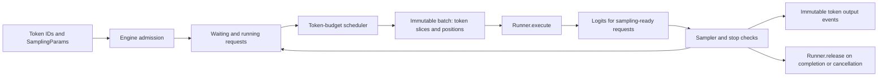
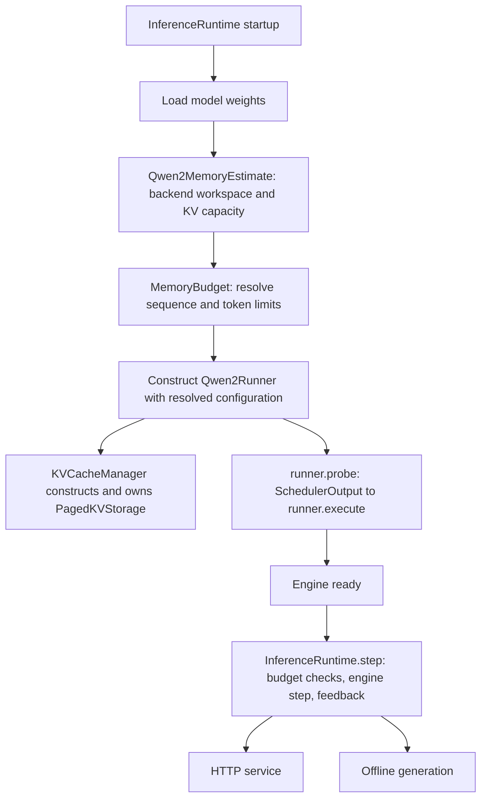

# ajvLLM inference architecture

## Scope and implementation stages

ajvLLM is an educational inference engine implemented independently of vLLM.
The implemented model target is Qwen2.5 dense decoder-only text generation,
including grouped-query attention (GQA). MoE, multimodal models, speculative
decoding, beam search, and production HTTP compatibility are outside this plan.
Scheduling policies operate on token counts and block ownership rather than tensor layouts or model weights.

| Stage | Deliverables | Exit criteria |
| --- | --- | --- |
| 1: framework (implemented here) | Request lifecycle, sampling, runner protocol, synchronous engine, streaming token outputs, continuous batching, token budgets, chunked prefill, cancellation, metrics, persistent serving | CUDA integration tests prove scheduling invariants, batched execution, and live request handling |
| 2a: model baseline (implemented) | Native Qwen2.5 weight loader, tokenizer adapter, eager dense/GQA forward, simple contiguous per-request KV storage | Full vs incremental and chunked logits agree with a trusted Qwen2 implementation on tiny and real checkpoints |
| 2b: memory (implemented) | KV cache manager, block allocator, paged storage, prefix sharing, eviction and recompute preemption | Same tokens as baseline; no leaks, double frees, invalid sharing, or budget oversubscription |
| 3: compute (implemented) | FlashAttention prefill, PagedAttention, Flash Decode, fused elementwise kernels | Numerical equivalence plus measured GPU latency and memory improvements |
| 4a/4b: advanced (implemented) | Bounded decode CUDA Graphs and W8A16 weight-only quantization | Graph replay parity, quantized-kernel parity, measured quality/memory/latency |

The native backend now executes each logical scheduler batch as one packed mixed model
forward, caches RoPE factors, and serves live HTTP/SSE requests. Synthetic CPU
artifacts have been removed. See the [model guide](../model_baseline.md) and
[serving guide](../serving.md). Paged storage, prefix reuse and native Triton inference kernels are implemented.

## Repository layout

```text
configs/engine/           reproducible scheduler settings
src/ajvllm/
  config/                validated engine limits and public input helpers
  requests/              mutable lifecycle and immutable output events
  engine/                admission, execution, sampling, stop checks, cleanup
  scheduling/            token-budget policy and immutable execution plans
  sampling/              parameter validation and batched CUDA sampling
  execution/             runner protocol, packed batch metadata, and CUDA Qwen runner
  tokenization/          token/text protocol and local Qwen chat tokenizer
  workflows/             CUDA text generation and persistent server entry points
  modeling/qwen2/        native eager dense/GQA model and checkpoint loader
  memory/                block ownership, paged CUDA storage, prefix index, contiguous reference
  attention/backends/    compact ragged metadata and compute-backend selection
  kernels/               Triton paged prefill/decode and fused elementwise operations
  runtime/               adaptive memory budget, shared execution and bounded decode graphs
  quantization/          per-channel W8A16 linear modules and conversion
  serving/               async engine service and HTTP/SSE
benchmarks/              reusable datasets; service metrics and serial vLLM comparison artifacts
tests/                   framework tests and CUDA model acceptance tests
```

## Data flow and ownership



The engine owns requests and their independent random generators. The scheduler
selects work and admits requests; it never samples, modifies progress counters,
or knows physical KV addresses. The runner owns execution state and returns
CUDA logits keyed by request ID, only where the plan requests sampling. One batch is
in flight at a time. Public methods are single-threaded; callers may submit or
cancel between `step()` calls. The asynchronous server serializes admission/cancellation commands
into this loop and offloads model steps to one dedicated execution thread.

The core accepts nonempty token ID sequences. Tokenization, chat templates, BOS
insertion, and text detokenization belong outside the scheduler. The tokenizer
protocol reserves that boundary. Stage 1 streams token deltas and cumulative token
IDs; stage 2a adds accumulated-token text decoding, while stop strings remain deferred. EOS and
explicit stop token IDs are supported and retained in raw output token IDs.

## Request lifecycle

`WAITING -> RUNNING -> FINISHED | CANCELLED | FAILED`.

Each request holds prompt IDs, output IDs, sampling parameters, computed-token
count, arrival/first-token/finish times, and a private RNG. Public outputs copy
state to immutable tuples. IDs must be unique among active requests and can be
reused after the terminal event has been delivered. Completed requests are removed
immediately; the engine does not accumulate an unbounded result history.

Admission rejects empty prompts, invalid IDs, prompts exceeding context capacity,
and invalid sampling settings. A prompt at the context limit or `max_tokens=0`
finishes without execution. Generation stops at the first eligible EOS/stop token,
output length limit, or context limit. `min_tokens` suppresses stop tokens before
sampling; it does not override context capacity. `ignore_eos` disables EOS stopping
but preserves explicit stop IDs. Cancellation releases waiting or running state
and returns a terminal event immediately. Unknown cancellation IDs return `None`.

A runner execution or output-validation failure fails all requests in that batch:
execution state may have partially advanced, so automatic retry would be unsafe.
Unscheduled requests remain usable. All affected resources are released; the
exception is re-raised as `EngineExecutionError` carrying terminal error outputs.
Release is an idempotent, non-throwing runner contract. There is no concurrent
cancellation of an in-flight batch in this stage.

When a sampled stop token also reaches a length limit, the stop reason takes
precedence. `min_tokens=N` masks stops for the first N generated tokens; the next
token can be a stop token. Requests already at the context limit never sample.

## Unified token accounting

For a request let `P` be prompt length, `G` output length, `C` computed input tokens,
and `T=P+G` currently available tokens. The pending work is `T-C`.

- During prefill, schedule a contiguous slice `[C, C+n)` of the prompt.
- A partial prefill produces no sample. Only reaching `T` enables sampling.
- At the end of prefill, `C=P`; sampling appends one output, so `T=P+1`.
- Each decode then consumes that one pending token and samples its successor.
- The last generated token need not be computed if the request terminates.

Always `0 <= C <= T <= max_model_len`. Progress is committed only after the whole
runner output is validated and sampling succeeds. Plans contain actual token IDs,
absolute starting positions, phase, and a sampling flag. The packed GPU batch derives positions, sequence/query offsets, query/context
lengths, masks, and sampling row indices from this boundary. Block tables and
physical slot mappings are reserved for the paged-memory stage.

## Scheduler algorithm

Configuration: `max_num_seqs`, `max_num_batched_tokens`, `max_model_len`,
`enable_chunked_prefill`, optional `max_prefill_chunk_size` per request, and
`max_prefill_tokens_per_step` for aggregate prefill work.

1. Start with the current per-step token budget (bounded by the configured ceiling).
2. Visit running decodes in rotating order, allocating one token each.
3. Limit remaining prefill work by the aggregate prefill cap. Rotate active
   prefills and select FIFO waiting candidates within available slots/token capacity.
4. Give prefills capped equal shares, redistributing unused shares from short
   prompts. Each chunk respects its prompt remainder and per-request chunk cap.
5. Return one immutable schedule, executed in one mixed `ModelBatch` forward.
   Prefill chunks and decode tokens share the original token budget.

Every batch has at most `max_num_seqs` entries and at most the token budget's
number of **input tokens**. Active slots include partially prefilled requests.
Completed slots are available on the next step, giving continuous batching.
Rotation prevents decode starvation if the budget is smaller than the active
request count. Prefills use residual capacity and can be delayed behind decodes;
finite output/context limits guarantee eventual progress for a finite workload.
The server may lower or raise the current budget from observed GPU memory and
conservative full-context admission estimates; see the serving guide.
This is an explicit educational decode-first policy, not a verbatim copy of the
current vLLM V1 scheduling policy. Priority scheduling and aging remain extensions.

Without chunking, a prefill must fit entirely in the current residual budget;
startup requires budget >= maximum context length to avoid impossible admissions.
A chunk cap is invalid when chunking is disabled. A blocked FIFO head is not
bypassed. Setting budget=1 is supported with chunking.

Example (budget=4): request A has six prompt tokens. Step 1 computes A[0:4].
Step 2 computes A[4:6], samples A, and can prefill two tokens of new request B.
Step 3 spends one token on A decode and up to three on B prefill. B samples only
when its last prompt token is processed.

The conceptual token accounting and per-iteration request lifecycle are informed
by the official [V1 scheduler](https://github.com/vllm-project/vllm/blob/main/vllm/v1/core/sched/scheduler.py)
and [engine core](https://github.com/vllm-project/vllm/blob/main/vllm/v1/engine/core.py).
These are moving references, consulted on 2026-09-14; ajvLLM does not promise API
compatibility or copy their implementation.

## Sampling

The runner only computes CUDA logits. The engine checks the result IDs and shapes,
then calls one CUDA sampler for all sampling-ready requests. There are no greedy
or CPU-fallback branches in the engine or runner.

The sampler stacks GPU rows and applies repetition penalty to prompt/generated
IDs, then presence/frequency penalties using generated-token counts, then masks
EOS and explicit stop IDs until `min_tokens` is reached. Counts, penalties, masks,
temperature, stable sorting, top-k/top-p filtering, normalization, inverse-CDF
selection, and selected-token log probabilities use CUDA tensors. `top_k=0` means
unlimited. Top-p retains the token crossing the cumulative threshold.

All requests follow the same distribution pipeline. `temperature=0` is represented
as top-k=1 with unit temperature; stable sorting chooses the smallest token ID on
ties. No argmax fast path or CPU sampler is retained. NaN, positive infinity and
all-masked distributions fail the whole batch before token outputs are committed.
Only a compact `[batch, 3]` packet (token ID, log probability, invalid flag) is
copied to the host; full logits never leave the GPU. Python loops assemble history
metadata and request-local RNG draws, not vocabulary-wide sampling calculations.

Each request lazily owns a CUDA `torch.Generator`, seeded independently. Identical
logits/policies and draw counts produce the same request-local stream irrespective
of batch membership/order. This replaces Python RNG: seeded outputs are not promised
to match the old implementation, other devices, or changed floating-point model
execution shapes. Sampling weights and scans use FP32; the top-p threshold product
and comparison use FP64 to avoid rounding a near-boundary threshold back onto a
token boundary. Selected metadata is packed into FP64 for exact token-ID transfer.

The CUDA sampler now replaces the original chain of small PyTorch operations with
three Triton stages around one stable CUDA sort:

1. Fused input conversion, repetition/presence/frequency penalties, stop masking
   and invalid-row detection.
2. Tiled exponentiation, top-k filtering and local cumulative weight scans. No
   full softmax, normalized probability tensor or second vocabulary-sized CDF is
   materialized. The tile totals form the upper level of the scan.
3. Nucleus cutoff lookup, inverse-CDF selection and selected-token log probability
   from the retained mass. Rounded endpoint draws cannot select a zero-mass tail.

Stable full-vocabulary sorting remains deliberately shared by all policies,
including temperature zero. It preserves ascending token-ID tie breaking and
avoids silently changing exact-k semantics to a threshold that admits every tie.
Sorting-free rejection/radix selection is not implemented. The new unnormalized
scan and the former normalize-then-scan path can round near-threshold distributions
differently; historical seeded tokens are not guaranteed bitwise identical.
Tests compare ordinary cases to a CUDA distribution oracle and cutoff boundaries
to higher-precision arithmetic, rather than reproducing old rounding artifacts.

Penalty history is allocated lazily only when needed. Each cached request uses
three INT32 vocabulary rows for seen IDs, generated counts and stop flags; neutral
policies without an active minimum-length mask allocate no history. Prompt IDs
are uploaded once and generated IDs incrementally. History update length is a
runtime kernel parameter, avoiding a new JIT variant for every prompt length.
The sampler bounds its LRU cache by engine sequence capacity and rebuilds evicted
entries from authoritative request token IDs after preemption. Engine terminal
paths explicitly release history; weak ownership also releases dropped standalone
requests. Expired stop-only history is discarded. No policy-specific sampling
branches or history manipulation were added to the engine loop.

This removes repeated history reconstruction and many launch/intermediate-buffer
costs while keeping request-local CUDA generators and the existing 24-byte result
packet per sampled request. Measurements and remaining limitations are recorded
in [benchmarking](../benchmarking.md#cuda-sampler-fusion-and-incremental-history).

## Stage 2a: Qwen2.5 baseline (implemented)

The native CUDA baseline, loader, tokenizer, runner, and GPU acceptance tests are
implemented. See the [baseline guide](../model_baseline.md) for interfaces, commands,
precision results, and limitations. The design below describes the original eager
reference; paged storage and optimized execution are implemented in Stages 2b/3.

All scheduled packed request tokens traverse embedding -> decoder layers -> final RMSNorm -> LM head in one forward. Each
layer uses pre-norm residual attention with RoPE, Q/K/V projections and output
projection, followed by pre-norm residual SwiGLU. Read all shape, bias, tying,
RoPE, and token settings from the checkpoint instead of assuming one model size.
Qwen2.5 checkpoints use `Qwen2ForCausalLM`; for example the
[official 0.5B configuration](https://huggingface.co/Qwen/Qwen2.5-0.5B-Instruct/blob/main/config.json)
has 14 query heads and 2 KV heads. Require query heads divisible by KV heads and
map query head h to KV head `h // (num_q_heads / num_kv_heads)`.

The loader reads local safetensors (including sharded indexes), validates tensor names/shapes,
and preserves tied embeddings when configured. Pair checkpoint tokenizer and chat
template with generation config EOS IDs. Reject MoE and unsupported RoPE/window
variants explicitly. Use Transformers for the tokenizer and as a model test oracle, not for engine execution.

The baseline uses eager attention and contiguous per-request layer K/V tensors. This
minimal state is required for real incremental/chunked computation; it is not yet
a block manager or memory optimization. Batched eager attention uses padded Q/K/V with per-request causal and context
masks, then gathers back to packed hidden states. RoPE tables are initialized once
and indexed by absolute positions. Numerical tests compare full prompt logits,
chunked logits, mixed batches, and incremental decoding before introducing paged layouts.

## Stage 2b: memory algorithms

Implemented as a separate memory subsystem. Serving and offline generation default
to paged storage; `MemoryConfig(backend="contiguous")` keeps the numerical reference.
The scheduler still produces one mixed `ModelBatch` and the runner calls the model
once. Paging changes KV ownership and storage, not the attention algorithm.

| Module | Responsibility |
| --- | --- |
| `config/memory.py` | Backend, block size, optional physical block count, prefix policy and namespace |
| `memory/blocks.py` | Physical IDs, reference counts, free queue and cached-page LRU eviction |
| `memory/manager.py` | Request block tables, atomic capacity reservation, prefix hashes and copy-on-write |
| `memory/storage.py` | Fixed CUDA pool, slot mappings, eager scatter/gather and stream lifetime events |
| `memory/contiguous.py` | Original cache packing/replacement path for numerical and performance comparisons |
| `scheduling/scheduler.py` | Admission, memory-pressure victim selection and recomputation |

For block size B, logical token t maps to block `t // B`, offset `t % B`.
The pool shape is `[layers, 2, num_blocks, B, kv_heads, head_dim]`. Each block
uses `2 * layers * B * kv_heads * head_dim * element_bytes` bytes. Capacity
reservation checks all required IDs before mutation; one ID represents storage
across all layers. The runner commits computed tokens and publishes prefix blocks
only after a successful complete model forward. Cancellation and execution failures
release request references. CUDA events order pool access across warmup and worker
streams, including failed forwards, before recycled pages are reused.

The old path copied each request's entire historical KV into replacement storage
on every step. Paged writes now scatter only newly computed tokens into their
physical slots. The eager attention adapter still gathers padded contexts into a
per-layer temporary tensor; it masks invalid slots to zero, including recycled
uninitialized values. The Stage 3 Triton backend bypasses these gathers and masks with direct paged
reads and fused RoPE/cache writes; the eager adapter remains the numerical oracle.

Prefix caching uses SHA-256 chained over the parent hash and each complete block's
token IDs. The root includes the configured namespace and request `cache_salt`.
Each manager belongs to one immutable model instance, positional configuration and
dtype: pages cannot cross model instances. There is no persistent
cache, adapter switching or hot weight reload. Future support for these must add
identity/version invalidation. An application requiring tenant isolation must assign
salts in its trusted admission layer; a client-provided salt is not authentication.

Only complete blocks are published. A cache hit leaves at least one token to
recompute because KV does not store final logits. Active references pin pages;
zero-reference cached pages remain reusable until LRU eviction. Uncached private
tails are recycled first. Independently computed duplicate hashes are not merged
within the same batch. A manager-level `fork` shares existing state; appending to a
shared partial tail first copies that block across layers. Failed copy allocation
leaves original ownership unchanged. The service currently exposes ordinary requests,
not beam search or a fork endpoint.

If a reservation cannot fit, the scheduler preempts the youngest unprotected
running request, releases its references and requeues it. It never preempts a
request already selected in the current batch. Replay processes the retained prompt
and generated token history without resampling old outputs; the request's CUDA RNG
state is preserved. A pool must fit at least one maximum-context request so that
recomputation can make progress. Token budget and physical page capacity remain
independent constraints. Prefix lookup alone does not count as a hit until admitted
work actually commits.

`num_blocks` defaults to `max_num_seqs * ceil(max_model_len / B)` after startup
capacity resolution. A smaller explicit pool permits overcommit with recomputation.
The pool is allocated once; freeing a request reduces live page references, not
PyTorch allocated bytes. `/health` reports pool, used, free, cached and shared blocks,
prefix-hit tokens, evictions, copy-on-write copies and preemptions. Free pages include
cached pages with zero references, so free and cached counts overlap.

CUDA tests cover full/partial prefixes, salts, last-token recomputation, shared tails,
exhaustion/rollback, stale hashes, cancellation, model failure, cross-stream reuse,
FP32/FP16/BF16 mixed batches and greedy/stochastic replay consistency. Small local
checkpoint measurements and their limitations are recorded in
[benchmarking](../benchmarking.md#stage-2b-bounded-comparison).

The ownership and hashing design follows [vLLM prefix caching](https://docs.vllm.ai/en/latest/design/prefix_caching/).
The eager block-table reference prepares the interface for
[vLLM-style paged attention](https://docs.vllm.ai/en/latest/design/paged_attention/),
with the native implementation described below.

## Stage 3: compute algorithms

Implemented native Triton forward kernels; model execution never calls vLLM,
Transformers or PyTorch SDPA as an attention implementation. Eager attention stays
available for numerical diagnosis and controlled comparisons. Both paths retain
one mixed packed `ModelBatch` and one model forward per scheduler step.

### Backend and metadata

`[compute] backend = "auto"` selects Triton for paged FP16/BF16 inference on SM80+
with head dimensions up to 256. `eager` explicitly selects the original path.
`triton` explicitly supports FP16/BF16/FP32 under these hardware/layout constraints;
unsupported explicit selections fail at startup. Auto keeps FP32 and contiguous
storage on eager. Floating-point kernels require even head dimensions as already
validated by Qwen2 config. Compilation/runtime failures are not silently hidden
by a fallback after cache mutation. The backend is reported in `/health`.

`AttentionMetadata` records packed query starts, context lengths, exact prefill
tiles and single-query request rows once per scheduler batch. Triton batches omit
the dense causal mask and paged `read_slots`/validity buffers. The manager still
owns block tables and packed write-slot mappings. Query/head padding is restricted
to small masked kernel tiles; a decode row never inherits a long prefill's query
matrix. Prefill/decode specialization happens inside each attention layer, not by
splitting full-model inputs. Linear projections, norms and MLPs remain packed.

### Paged FlashAttention prefill

`kernels/attention.py::_prefill` streams KV tiles directly from physical pages.
Logical offset n reads `table[row, n // block_size] * block_size + n % block_size`.
Query head h uses KV head `h // (num_query_heads / num_kv_heads)`, without repeating
KV tensors. A query's absolute position is `context_length - query_length + q`;
this handles full prefill, prefix hits and multiple chunks with the same kernel.
Programs cover actual per-request query tiles, including non-power-of-two tails.

Each tile maintains FP32 row maximum m, normalizer l and weighted output a.
For score tile S, update `m' = max(m, rowmax(S))`, `p = exp(S - m')`,
`l' = exp(m - m') * l + rowsum(p)` and
`a' = exp(m - m') * a + p @ V`. Store `a / l` after the final causal tile.
There is no context-sized score/probability allocation or dense KV gather.
FP16/BF16 dot products use tensor cores; explicit FP32 uses IEEE dot precision.
Head dimensions above 128 use smaller key tiles and one pipeline stage to fit
Ampere shared memory. An SM86 test exposed an oversized FP32 D=256 tile and
motivated this shape-specific launch policy.

### Paged decode and Flash Decode

`_decode` handles rows with one query token, including a one-token prefill tail.
Short contexts use one streaming program per request/head and write final output
directly. At maximum decode context >=1024, the backend uses 256-token partitions.
Each program emits its normalized partial output and FP32 log-sum-exp. `_merge`
weights partial outputs by `exp(lse_partition - logsumexp(all_lse))`. Empty
partitions contribute zero output and negative-infinity LSE, so ragged requests
can share the launch grid safely. The split workspace scales with request count,
heads, partitions and head dimension, rather than a padded query-by-context matrix.
The partition threshold is a conservative initial policy, not an exhaustive
autotuning result for every GPU/model combination.

### Elementwise fusions

`kernels/elementwise.py` implements row-wise RMSNorm, residual-add + RMSNorm,
SwiGLU, and Qwen split-half RoPE fused with new K/V slot writes. Each scheduled
K/V token is written once; cached historical KV is never rewritten. Residual and
normalization intermediates preserve the eager activation-dtype rounding points.
Rotary factors are still indexed from the model's precomputed tables. Checkpoint
parameters, names and projections are unchanged.

The RMSNorm/SwiGLU/rotary kernels and online-softmax recurrence were adapted from
`../ajllm/src/ajllm/modeling/cuda_kernels.py` and `flash_attention.py`. Training
backward paths were not copied. Qwen's split-half RoPE differs from ajllm's adjacent
pair layout; ragged paging, GQA mapping, absolute chunk offsets, decode partitions
and LSE merging are implemented here. Algorithm references are the
[Triton fused-attention tutorial](https://triton-lang.org/main/getting-started/tutorials/06-fused-attention.html)
and [vLLM paged-attention design](https://docs.vllm.ai/en/latest/design/paged_attention/).

### Capacity, JIT and validation

`Qwen2MemoryEstimate` uses the resolved backend. Triton retains the physical pool,
packed activation/sampling reserves and split-decode workspace, but removes the
eager quadratic attention and dense KV gather terms. Startup peak measurements
and runtime budget control remain enabled. Warmup compiles the shapes it executes;
first use of another dtype/head/split variant can still incur JIT latency.
Block-table width and SwiGLU token count are runtime values to avoid recompiling
for every context or batch length. Short decode avoids a redundant merge launch.

CUDA tests cover mixed/chunked batches, noncontiguous physical pages, odd page
sizes, head dimensions 8/16/48/64/128/256, 7:1 GQA, large logits, long-context
split decode with empty partitions, prefix reuse, memory-pressure replay and live
HTTP arrivals/cancellation/failure. A structural test rejects dense KV gather and
asserts one model forward with no dense causal mask. FP32/FP16/BF16 kernels are
compared with eager/FP32 attention oracles; reduced-precision floating-point
reordering can change logits or sampled tokens and is not bitwise equivalence.
Bounded real-model parity and performance results are in
[benchmarking](../benchmarking.md#stage-3-compute-comparison).

## Stage 4: advanced execution

### CUDA Graphs (implemented)

`runtime/graphs.py::DecodeGraphs` owns static inputs, captured outputs and CUDA
graphs. The runner delegates model execution after the scheduler reserves KV pages;
request admission, allocation, prefix publication, sampling and RNG advancement stay
outside capture. `GraphConfig` is independent of compute/quantization settings.
Graph execution requires the Triton paged backend and is opt-in.

The capture key is `(batch_bucket, context_bucket)`. Batch buckets default to
1/2/4/8; context buckets round up to powers of two starting at 128 and clamp to
the engine limit. Every real row must contain exactly one sampling-ready token.
This includes ordinary decode and eligible one-token prompt tails. Other shapes,
including multi-token prefill/mixed batches or partial prefills with no logits,
use the normal Triton forward. No whole-model prefill/decode split is introduced.

Static buffers hold token IDs, absolute positions, contexts, block tables and
physical write slots. Before replay the runtime copies current metadata and zeros
unused rows. Padded rows have context zero and slot -1: the fused cache writer masks
negative slots, and decode/merge return finite zero attention for empty partitions.
Padding therefore neither reads real context nor writes live cache pages. Block
ownership can change between replays; the captured KV pool address stays fixed.
Returned logits are cloned from graph outputs so later replays cannot mutate a
previous caller's results.

Two uncaptured warmup forwards initialize kernels/BLAS on a dedicated stream before
capture. They repeat the same new-token slot writes without committing tokens or
sampling; writes are idempotent for the fixed input and current history. Events
order capture/replay, KV reuse and output copies across warmup and service streams.
Graph construction does not allocate logical KV pages. Model forward temporaries
are allocated in PyTorch's graph-private pool during capture and reused on replay.
Capture failures propagate through existing engine cleanup; they do not silently
retry potentially advanced requests.

`max_graphs` and `memory_limit_mb` bound retention. A conservative estimate rejects
new shapes before capture when headroom is insufficient; observed reserved/allocated
growth can reject a capture afterward. This is a retention budget, not a hard
bound on temporary capture-time allocations. The process memory estimator reserves
the entire configured graph allowance in addition to weights, KV and workspace.
Rejected shapes fall back to normal execution, with no eviction/recapture churn.
Graphs live for the runner's lifetime; weights, quantization and KV pool must not
be replaced after capture. `/health.graphs` reports captures, replays, fallbacks,
cached graph count and conservative retained-budget bytes. First capture is cold
latency and should be excluded from steady-state benchmark results.

The capture/lifetime approach follows [PyTorch CUDA Graph guidance](https://pytorch.org/docs/stable/notes/cuda.html#cuda-graphs)
and [vLLM graph dispatch](https://docs.vllm.ai/en/latest/design/cuda_graphs/).
Full mixed/prefill capture remains a possible extension, not a requirement for
this decode optimization. CUDA tests cover padding, changed token/page metadata,
context bucket transitions, split decode, cross-stream replay, cache limits,
retained-logit ownership, capture failures and combined quantized service requests.

### W8A16 quantization (implemented)

`quantization/linear.py::Int8Linear` replaces decoder Q/K/V/O and gate/up/down
projections. For output channel j, `scale[j] = max(abs(W[j])) / 127` and
`qweight[j] = round(W[j] / scale[j]).clamp(-127, 127)`. Zero rows use scale 1.
Weights are INT8, scales FP32, and there is no zero point. Activations, bias and
KV remain FP16/BF16. Embeddings, tied/untied LM head and norms retain their original
precision. This is post-training abs-max weight quantization without calibration;
it does not implement activation outlier handling, GPTQ/AWQ, INT4 or quantized KV.

The loader still reads the existing floating-point checkpoint. Runtime conversion
runs before memory calibration, runner construction and graph capture, releasing
original projection parameters. Conversion uses slices of at most 128 output rows
to bound FP32 scratch, but the original full model must first fit on the GPU.
Pre-quantized checkpoint import/export and hot model conversion are not supported.
Scale/weight buffers are explicit in the module state; `/health.quantization`
reports scheme, dtypes, converted layer count and model storage bytes.

`kernels/quantization.py` supplies two native paths: a small-row reduction kernel
for <=8 activation rows, and tiled GEMM for larger batches. Both load INT8 weights,
dequantize within the kernel and accumulate in FP32. GEMM uses FP16/BF16 tensor-core
dots after tile dequantization; it is not an INT8-activation matmul. No full floating
weight matrix is materialized by production forward. `Int8Linear.reference`
explicitly dequantizes on CUDA only as a numerical oracle.

Graph and quantization switches are independent and can be combined. Quantization
reduces model residency but does not promise faster prefill/decode: conversion and
GEMM tiling can offset lower weight traffic. Validation separates kernel agreement
with the dequantized oracle from loss/next-token agreement with original weights.
Floating-point rounding and weight approximation can change sampled text. Bounded
local quality, memory and latency measurements are recorded in
[benchmarking](../benchmarking.md#stage-4-graphs-and-quantization).

## Validation and observability

CUDA integration tests cover exact slices, chunk boundaries, no premature sampling,
decode-first mixed batches, FIFO admission, rotating decodes, slot reuse,
per-step token limits, terminal reasons, independent RNG, input validation,
runner contract failures, and release on every terminal path. Finite workloads compare outputs across budgets/chunk sizes and assert eventual
drain. Service tests add in-flight arrivals, TCP/SSE disconnects, backpressure,
shutdown, and adaptive memory budgeting.

Engine metrics count iterations, scheduled prefill/decode input tokens, generated
tokens, and finished/cancelled/failed requests. Outputs include arrival, first-token,
and finish timestamps using a monotonic clock. TTFT = first token - arrival;
end-to-end latency = finish - arrival. Queue/compute separation, GPU utilization,
KV occupancy, cache hit rate, preemptions, p50/p95/p99 inter-token latency, and
throughput belong to later trace/GPU benchmarks. Current correctness tests and
server smoke checks are not throughput benchmarks.

## Implementation refinements

- Mixed batching: separate whole-model prefill/decode launches duplicated work.
  Each schedule now produces one packed `ModelBatch`; eager attention still pads
  query/context dimensions. Future kernels can remove padding behind that interface.
- RoPE and loading: cached rotary tables avoid per-forward trigonometry; shared
  tied-parameter allocation avoids a transient duplicate embedding/head allocation.
- Sampling: full CPU vocabulary sorting caused large host stalls. A greedy-only
  CUDA shortcut improved that case but complicated engine dispatch and left other
  policies on CPU. The current unified CUDA sampler handles all policies and moves
  only selected results back to the host. Legacy CPU/GPU comparison scripts were
  removed after validation; correctness tests remain.
- GQA: grouped QK/PV matmuls share K/V directly rather than repeating them per query
  head. A bounded earlier experiment reduced live peak allocations by about 16 MiB;
  repeated measurements did not establish a reliable throughput gain. The capacity
  estimate keeps a conservative workspace reserve.

With `--profile-steps`, cumulative stage times cover preparation, model forward,
CUDA sampling, and compact result transfer. Normal execution adds no profiling
synchronizations. Allocated/reserved memory is reported separately from device-wide
nvidia-smi memory. See [benchmarking](../benchmarking.md) for metric definitions.

### Runtime and memory ownership refinement

The previous `MemoryBudget` both inspected Qwen2 internals and initialized the
runner's KV manager. Its warmup bypassed the runner for contiguous storage, and
offline generation did not apply runtime budget adjustments. These responsibilities
are now separated:



`runtime/budget.py` remains in `runtime/`: process memory headroom, warmup peak
feedback and token-budget adaptation are execution policies, not KV ownership or
HTTP concerns. The controller receives an estimate callable; it does not import
a model, runner, KV manager or attention layout. Its constructor only resolves
capacity; explicit `warmup(probe)` performs device work after runner construction.
The initial budget comes from the configured token ceiling, reduced as necessary.

`execution/capacity.py` contains `Qwen2MemoryEstimate`, the eager backend's
model-specific workspace estimate. It uses architecture dimensions, element size
and immutable engine/memory settings, without retaining model weights or a runner.
It excludes loaded weights/static buffers, which the controller measures once
before the KV pool exists. Runtime estimates include the resolved pool capacity
once, avoiding double counting.

`runtime/inference.py` coordinates startup for both CLIs: load weights, plan
capacity, construct the runner with `memory_config` and resolved `engine_config`,
then warm up. This order preserves constructor-time KV initialization without
allocating an uncalibrated maximum pool. Direct fixed-capacity callers can pass
these two configurations to `Qwen2Runner` themselves. There is no post-construction
`configure_memory` operation. Omitting memory configuration on a direct runner
keeps the contiguous numerical baseline.

`KVCacheManager` receives cache policy, capacity and tensor dimensions/device/dtype;
it derives block count, validates single-request capacity and constructs the
physical pool itself. It never receives a Qwen2 model. `Qwen2Runner.probe` constructs
prefill and decode `SchedulerOutput` objects for both backends. Only prefix-publication
suppression is backend-specific; cleanup always uses `runner.release`, including
failed warmup attempts. The manager's prefix policy is restored in `finally`.

`InferenceRuntime.step/run` applies budget checks and successful-step feedback in
both online and offline execution. CUDA OOM lowers the next budget and propagates
the engine's existing failure outputs; it never retries advanced requests silently.
`EngineService` receives the existing `InferenceRuntime` directly and retains no
separate engine/budget state. The HTTP service owns transport queues, cancellation
and profiling, while the
model-independent `Engine.step/run` remains available for fixed-budget tests.
