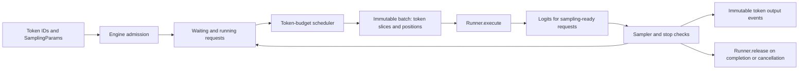

# ajvLLM inference architecture

## Scope and implementation stages

ajvLLM is an educational inference engine implemented independently of vLLM.
The implemented model target is Qwen2.5 dense decoder-only text generation,
including grouped-query attention (GQA). MoE, multimodal models, speculative
decoding, beam search, and production HTTP compatibility are outside this plan.
The control plane must not depend on Torch, CUDA, tensor layouts, or model weights.

| Stage | Deliverables | Exit criteria |
| --- | --- | --- |
| 1: framework (implemented here) | Request lifecycle, sampling, runner protocol, synchronous engine, streaming token outputs, continuous batching, token budgets, chunked prefill, cancellation, metrics, persistent serving | CUDA integration tests prove scheduling invariants, batched execution, and live request handling |
| 2a: model baseline (implemented) | Native Qwen2.5 weight loader, tokenizer adapter, eager dense/GQA forward, simple contiguous per-request KV storage | Full vs incremental and chunked logits agree with a trusted Qwen2 implementation on tiny and real checkpoints |
| 2b: memory (planned) | KV cache manager, block allocator, paged storage, prefix sharing, eviction and recompute preemption | Same tokens as baseline; no leaks, double frees, invalid sharing, or budget oversubscription |
| 3: compute (planned) | FlashAttention prefill, PagedAttention, Flash Decode, fused elementwise kernels | Numerical equivalence plus measured GPU latency and memory improvements |
| 4: advanced (planned) | CUDA Graphs, quantization, tensor parallelism, prefill/decode disaggregation | Backend parity, distributed correctness, and workload-specific performance evidence |

The native backend now executes each logical scheduler batch as one packed mixed model
forward, caches RoPE factors, and serves live HTTP/SSE requests. Synthetic CPU
artifacts have been removed. See the [model guide](../model_baseline.md) and
[serving guide](../serving.md). Memory paging and optimized kernels remain planned.

## Repository layout

```text
configs/engine/           reproducible scheduler settings
src/ajvllm/
  config/                validated engine limits and public input helpers
  requests/              mutable lifecycle and immutable output events
  engine/                admission, execution, sampling, stop checks, cleanup
  scheduling/            token-budget policy and immutable execution plans
  sampling/              parameter validation and batched CUDA sampling
  execution/             runner protocol, packed batch metadata, and CUDA Qwen runner
  tokenization/          token/text protocol and local Qwen chat tokenizer
  workflows/             CUDA text generation and persistent server entry points
  modeling/qwen2/        native eager dense/GQA model and checkpoint loader
  memory/                planned cache manager, block pool, prefix index
  attention/backends/    planned eager/paged attention interfaces
  kernels/               planned Torch/Triton/CUDA kernels
  runtime/               adaptive CUDA memory budget; graph capture remains planned
  quantization/          planned quantized linear and KV representations
  distributed/           planned TP collectives and KV transfer
  serving/               async engine service and HTTP/SSE; disaggregation remains planned
benchmarks/              planned trace, latency, throughput, and memory studies
tests/                   framework tests and CUDA model acceptance tests
```

## Data flow and ownership



The engine owns requests and their independent random generators. The scheduler
selects work and admits requests; it never samples, modifies progress counters,
or knows physical KV addresses. The runner owns execution state and returns
CUDA logits keyed by request ID, only where the plan requests sampling. One batch is
in flight at a time. Public methods are single-threaded; callers may submit or
cancel between `step()` calls. The asynchronous server serializes admission/cancellation commands
into this loop and offloads model steps to one dedicated execution thread.

The core accepts nonempty token ID sequences. Tokenization, chat templates, BOS
insertion, and text detokenization belong outside the scheduler. The tokenizer
protocol reserves that boundary. Stage 1 streams token deltas and cumulative token
IDs; stage 2a adds accumulated-token text decoding, while stop strings remain deferred. EOS and
explicit stop token IDs are supported and retained in raw output token IDs.

## Request lifecycle

`WAITING -> RUNNING -> FINISHED | CANCELLED | FAILED`.

Each request holds prompt IDs, output IDs, sampling parameters, computed-token
count, arrival/first-token/finish times, and a private RNG. Public outputs copy
state to immutable tuples. IDs must be unique among active requests and can be
reused after the terminal event has been delivered. Completed requests are removed
immediately; the engine does not accumulate an unbounded result history.

Admission rejects empty prompts, invalid IDs, prompts exceeding context capacity,
and invalid sampling settings. A prompt at the context limit or `max_tokens=0`
finishes without execution. Generation stops at the first eligible EOS/stop token,
output length limit, or context limit. `min_tokens` suppresses stop tokens before
sampling; it does not override context capacity. `ignore_eos` disables EOS stopping
but preserves explicit stop IDs. Cancellation releases waiting or running state
and returns a terminal event immediately. Unknown cancellation IDs return `None`.

A runner execution or output-validation failure fails all requests in that batch:
execution state may have partially advanced, so automatic retry would be unsafe.
Unscheduled requests remain usable. All affected resources are released; the
exception is re-raised as `EngineExecutionError` carrying terminal error outputs.
Release is an idempotent, non-throwing runner contract. There is no concurrent
cancellation of an in-flight batch in this stage.

When a sampled stop token also reaches a length limit, the stop reason takes
precedence. `min_tokens=N` masks stops for the first N generated tokens; the next
token can be a stop token. Requests already at the context limit never sample.

## Unified token accounting

For a request let `P` be prompt length, `G` output length, `C` computed input tokens,
and `T=P+G` currently available tokens. The pending work is `T-C`.

- During prefill, schedule a contiguous slice `[C, C+n)` of the prompt.
- A partial prefill produces no sample. Only reaching `T` enables sampling.
- At the end of prefill, `C=P`; sampling appends one output, so `T=P+1`.
- Each decode then consumes that one pending token and samples its successor.
- The last generated token need not be computed if the request terminates.

Always `0 <= C <= T <= max_model_len`. Progress is committed only after the whole
runner output is validated and sampling succeeds. Plans contain actual token IDs,
absolute starting positions, phase, and a sampling flag. The packed GPU batch derives positions, sequence/query offsets, query/context
lengths, masks, and sampling row indices from this boundary. Block tables and
physical slot mappings are reserved for the paged-memory stage.

## Scheduler algorithm

Configuration: `max_num_seqs`, `max_num_batched_tokens`, `max_model_len`,
`enable_chunked_prefill`, optional `max_prefill_chunk_size` per request, and
`max_prefill_tokens_per_step` for aggregate prefill work.

1. Start with the current per-step token budget (bounded by the configured ceiling).
2. Visit running decodes in rotating order, allocating one token each.
3. Limit remaining prefill work by the aggregate prefill cap. Rotate active
   prefills and select FIFO waiting candidates within available slots/token capacity.
4. Give prefills capped equal shares, redistributing unused shares from short
   prompts. Each chunk respects its prompt remainder and per-request chunk cap.
5. Return one immutable schedule, executed in one mixed `ModelBatch` forward.
   Prefill chunks and decode tokens share the original token budget.

Every batch has at most `max_num_seqs` entries and at most the token budget's
number of **input tokens**. Active slots include partially prefilled requests.
Completed slots are available on the next step, giving continuous batching.
Rotation prevents decode starvation if the budget is smaller than the active
request count. Prefills use residual capacity and can be delayed behind decodes;
finite output/context limits guarantee eventual progress for a finite workload.
The server may lower or raise the current budget from observed GPU memory and
conservative full-context admission estimates; see the serving guide.
This is an explicit educational decode-first policy, not a verbatim copy of the
current vLLM V1 scheduling policy. Priority scheduling and aging remain extensions.

Without chunking, a prefill must fit entirely in the current residual budget;
startup requires budget >= maximum context length to avoid impossible admissions.
A chunk cap is invalid when chunking is disabled. A blocked FIFO head is not
bypassed. Setting budget=1 is supported with chunking.

Example (budget=4): request A has six prompt tokens. Step 1 computes A[0:4].
Step 2 computes A[4:6], samples A, and can prefill two tokens of new request B.
Step 3 spends one token on A decode and up to three on B prefill. B samples only
when its last prompt token is processed.

The conceptual token accounting and per-iteration request lifecycle are informed
by the official [V1 scheduler](https://github.com/vllm-project/vllm/blob/main/vllm/v1/core/sched/scheduler.py)
and [engine core](https://github.com/vllm-project/vllm/blob/main/vllm/v1/engine/core.py).
These are moving references, consulted on 2026-09-14; ajvLLM does not promise API
compatibility or copy their implementation.

## Sampling

The runner only computes CUDA logits. The engine checks the result IDs and shapes,
then calls one CUDA sampler for all sampling-ready requests. There are no greedy
or CPU-fallback branches in the engine or runner.

The sampler stacks GPU rows and applies repetition penalty to prompt/generated
IDs, then presence/frequency penalties using generated-token counts, then masks
EOS and explicit stop IDs until `min_tokens` is reached. Counts, penalties, masks,
temperature, stable sorting, top-k/top-p filtering, normalization, inverse-CDF
selection, and selected-token log probabilities use CUDA tensors. `top_k=0` means
unlimited. Top-p retains the token crossing the cumulative threshold.

All requests follow the same distribution pipeline. `temperature=0` is represented
as top-k=1 with unit temperature; stable sorting chooses the smallest token ID on
ties. No argmax fast path or CPU sampler is retained. NaN, positive infinity and
all-masked distributions fail the whole batch before token outputs are committed.
Only a compact `[batch, 3]` packet (token ID, log probability, invalid flag) is
copied to the host; full logits never leave the GPU. Python loops assemble history
metadata and request-local RNG draws, not vocabulary-wide sampling calculations.

Each request lazily owns a CUDA `torch.Generator`, seeded independently. Identical
logits/policies and draw counts produce the same request-local stream irrespective
of batch membership/order. This replaces Python RNG: seeded outputs are not promised
to match the old implementation, other devices, or changed floating-point model
execution shapes. Sampling arithmetic uses FP32. Custom sampling kernels are a
future optimization behind this interface.

## Stage 2a: Qwen2.5 baseline (implemented)

The native CUDA baseline, loader, tokenizer, runner, and GPU acceptance tests are
implemented. See the [baseline guide](../model_baseline.md) for interfaces, commands,
precision results, and limitations. The design below describes the supported path;
paged storage and optimized execution remain future work.

All scheduled packed request tokens traverse embedding -> decoder layers -> final RMSNorm -> LM head in one forward. Each
layer uses pre-norm residual attention with RoPE, Q/K/V projections and output
projection, followed by pre-norm residual SwiGLU. Read all shape, bias, tying,
RoPE, and token settings from the checkpoint instead of assuming one model size.
Qwen2.5 checkpoints use `Qwen2ForCausalLM`; for example the
[official 0.5B configuration](https://huggingface.co/Qwen/Qwen2.5-0.5B-Instruct/blob/main/config.json)
has 14 query heads and 2 KV heads. Require query heads divisible by KV heads and
map query head h to KV head `h // (num_q_heads / num_kv_heads)`.

The loader reads local safetensors (including sharded indexes), validates tensor names/shapes,
and preserves tied embeddings when configured. Pair checkpoint tokenizer and chat
template with generation config EOS IDs. Reject MoE and unsupported RoPE/window
variants explicitly. Use Transformers for the tokenizer and as a model test oracle, not for engine execution.

The baseline uses eager attention and contiguous per-request layer K/V tensors. This
minimal state is required for real incremental/chunked computation; it is not yet
a block manager or memory optimization. Batched eager attention uses padded Q/K/V with per-request causal and context
masks, then gathers back to packed hidden states. RoPE tables are initialized once
and indexed by absolute positions. Numerical tests compare full prompt logits,
chunked logits, mixed batches, and incremental decoding before introducing paged layouts.

## Stage 2b: memory algorithms

Planned ownership: scheduler requests logical capacity from `KVCacheManager`;
`BlockManager` owns physical page IDs, a free queue, reference counts, and eviction
metadata; attention reads block tables and tensor storage without allocating.

For block size B, logical token t maps to block `t // B`, offset `t % B`. A request
needs `ceil((C+n)/B)` resident blocks before executing n tokens. Estimate bytes per
block as `2 * layers * B * kv_heads * head_dim * element_bytes`, adjusted later
for TP and quantization. Reserve enough capacity atomically across all layers;
on failure roll back reservations before changing computed-token counts.

First implement block tables over an eager gather/scatter attention reference.
Then implement native paged reads/writes. Allocation, indexing, and kernel speed
are separate milestones. Reuse pages only after all device users complete.

Prefix caching indexes complete blocks by chained hashes of parent prefix and
block tokens, plus model revision, adapters, positional settings, cache dtype,
and isolation domain. Shared pages are immutable; writable shared tails require
copy-on-write. A hit advances only verified reusable computed tokens; if final
prompt logits are absent, leave at least the final token to recompute for sampling.
Use reference counts for ownership and LRU among unreferenced blocks for eviction.
This plan follows the concepts in [vLLM prefix caching](https://docs.vllm.ai/en/latest/design/prefix_caching/).

Under pressure, preempt a selected running request, release its private pages,
reset its computed prefix to reusable cached state (or zero), and requeue for
recomputation without resampling already generated outputs. Preserve RNG state
and distinguish replay from new generation. Tests must cover shared prefixes,
partial tails, exhaustion, rollback, cancellation, stale hashes, and preemption.

## Stage 3: compute algorithms

- FlashAttention prefill: tile Q/K/V, maintain online softmax maximum and normalizer,
  accumulate weighted values without materializing the quadratic score matrix.
  Support causal masks, chunk offsets, variable lengths, and GQA.
- PagedAttention: gather K/V via logical-to-physical block tables and write newly
  computed slots exactly once. First verify against the eager paged reference;
  the [vLLM attention design](https://docs.vllm.ai/en/latest/design/paged_attention/)
  is a useful layout/kernel reference, not a mandatory tensor layout.
- Flash Decode: split a long KV sequence among programs for one/few query tokens;
  merge partial outputs using their log-sum-exp values to preserve normalization.
- Fuse RMSNorm, residual additions, RoPE, and SwiGLU after attention is correct.
  Select a backend by phase, shape, dtype, device capability, and layout.

Keep an eager numerical oracle. Cover uneven head/block sizes, all supported
lengths, large logits, mixed prefill/decode, and float32/bfloat16/float16 tolerances.
Benchmark TTFT and inter-token latency separately; a faster prefill kernel may
not improve decode. Kernel changes must preserve scheduler token accounting.

## Stage 4: advanced execution

**CUDA Graphs:** capture stable tensor addresses with bucketed batch/token shapes,
update input/metadata buffers before replay, mask padding, and fall back to eager
for unsupported shapes. Never allocate dynamic KV pages inside capture. Verify
padding cannot write live cache slots. See [vLLM graph design](https://docs.vllm.ai/en/latest/design/cuda_graphs/).

**Quantization:** introduce explicit weight/activation/KV dtype and scale metadata.
Start with one format and a dequantized reference, then a native quantized GEMM.
Specify per-tensor/channel/group scaling and calibration requirements. Validate
logit error, task quality, memory use, and latency independently; quantization is
not expected to preserve sampled tokens exactly.

**Tensor parallelism:** shard Q/K/V and MLP gate/up projections by output channels;
shard attention output and MLP down projections by input channels, then reduce.
Shard or replicate KV heads according to divisibility, handle vocabulary-parallel
embedding/logits, and synchronize the sampling decision across ranks. Test uneven
or unsupported head/vocabulary layouts with explicit validation. Compare TP=1
and multi-rank outputs, failure handling, and checkpoint sharding.

**Prefill/decode disaggregation:** a router selects separate workers; prefill
produces KV plus position/model/layout metadata and a well-defined first-token
handoff. Decode acknowledges ownership before the producer frees data. Maintain
request epoch IDs, transfer completion, cancellation propagation, timeout/retry
rules, and layout compatibility. Never schedule decode before all required KV
arrives. Transfer cost and queueing may outweigh isolation benefits; measure both.
See [vLLM disaggregated prefill](https://docs.vllm.ai/en/latest/features/disagg_prefill/).

## Validation and observability

CUDA integration tests cover exact slices, chunk boundaries, no premature sampling,
decode-first mixed batches, FIFO admission, rotating decodes, slot reuse,
per-step token limits, terminal reasons, independent RNG, input validation,
runner contract failures, and release on every terminal path. Finite workloads compare outputs across budgets/chunk sizes and assert eventual
drain. Service tests add in-flight arrivals, TCP/SSE disconnects, backpressure,
shutdown, and adaptive memory budgeting.

Engine metrics count iterations, scheduled prefill/decode input tokens, generated
tokens, and finished/cancelled/failed requests. Outputs include arrival, first-token,
and finish timestamps using a monotonic clock. TTFT = first token - arrival;
end-to-end latency = finish - arrival. Queue/compute separation, GPU utilization,
KV occupancy, cache hit rate, preemptions, p50/p95/p99 inter-token latency, and
throughput belong to later trace/GPU benchmarks. Current correctness tests and
server smoke checks are not throughput benchmarks.

## Implementation refinements

- Mixed batching: separate whole-model prefill/decode launches duplicated work.
  Each schedule now produces one packed `ModelBatch`; eager attention still pads
  query/context dimensions. Future kernels can remove padding behind that interface.
- RoPE and loading: cached rotary tables avoid per-forward trigonometry; shared
  tied-parameter allocation avoids a transient duplicate embedding/head allocation.
- Sampling: full CPU vocabulary sorting caused large host stalls. A greedy-only
  CUDA shortcut improved that case but complicated engine dispatch and left other
  policies on CPU. The current unified CUDA sampler handles all policies and moves
  only selected results back to the host. Legacy CPU/GPU comparison scripts were
  removed after validation; correctness tests remain.
- GQA: grouped QK/PV matmuls share K/V directly rather than repeating them per query
  head. A bounded earlier experiment reduced live peak allocations by about 16 MiB;
  repeated measurements did not establish a reliable throughput gain. The capacity
  estimate keeps a conservative workspace reserve.

With `--profile-steps`, cumulative stage times cover preparation, model forward,
CUDA sampling, and compact result transfer. Normal execution adds no profiling
synchronizations. Allocated/reserved memory is reported separately from device-wide
nvidia-smi memory. See [benchmarking](../benchmarking.md) for metric definitions.
