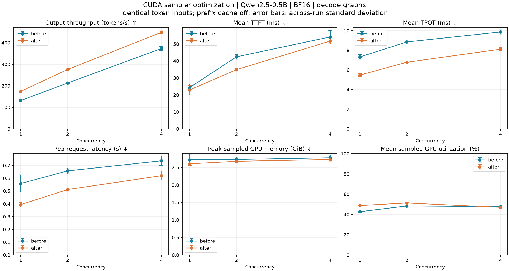

# Service benchmarking

Start the server in one terminal and the benchmark client in another. The client
does not load model weights. Run GPU workloads serially; begin with concurrency 1,
then 2 and 4. The local RTX 3080 Ti has 12 GiB; higher concurrency is not a default
validation target for the padded eager backend.

```bash
# Terminal 1: restart for each controlled comparison.
uv run ajvllm-serve --config configs/engine/benchmark.toml --profile-steps

# Terminal 2: general stochastic sampling, repeated small dataset.
uv run ajvllm-benchmark --concurrency 1 --requests 64 --max-tokens 16 \
  --temperature 0.8 --top-p 0.9 --seed 0 --output benchmarks/results/c1.json
uv run ajvllm-benchmark --concurrency 4 --requests 64 --max-tokens 16 \
  --temperature 0.8 --top-p 0.9 --seed 0 --output benchmarks/results/c4.json
uv run ajvllm-benchmark --concurrency 8 --requests 64 --max-tokens 16 \
  --temperature 0.8 --top-p 0.9 --seed 0 --output benchmarks/results/c8.json
uv run ajvllm-benchmark --concurrency 16 --requests 64 --max-tokens 16 \
  --temperature 0.8 --top-p 0.9 --seed 0 --output benchmarks/results/c16.json
uv run ajvllm-benchmark --concurrency 32 --requests 64 --max-tokens 16 \
  --temperature 0.8 --top-p 0.9 --seed 0 --output benchmarks/results/c32.json
```

The CLI defaults are 24 requests, concurrency 4, 64 output tokens, one excluded
sequential warmup request, temperature 0.8, top-p 0.9, unlimited top-k, seed 0,
and a 300-second socket timeout. `--top-k` enables a candidate limit;
`--temperature 0` requests deterministic selection through the same CUDA sampler.
The report records the sampling settings, including the seed. The workflow fixes
`ignore_eos=true` to request a repeatable output length; actual token counts are
recorded because context capacity can still shorten a response.

## Choosing scheduling budgets

`ajvllm-benchmark-budget-config` starts and stops its own CUDA services serially.
Do not start a separate server for this workflow. The configured `max_model_len`
remains unchanged (16384 in `configs/engine/benchmark.toml`). Two primary knobs
are exposed: `max_num_batched_tokens` bounds total work per step, including decode,
and `max_num_seqs` bounds active sequences. The scheduler automatically divides
remaining tokens among actual prefill requests and redistributes unused shares.
A fixed chunk of `token_budget / max_num_seqs` would unnecessarily slow a lone
prefill; the benchmark configuration therefore omits both optional prefill caps.
Explicit caps remain supported for advanced policies and backward compatibility.

```bash
# First: long-input, two-output-token prefill sweep at fixed concurrency.
uv run ajvllm-benchmark-budget-config --phase prefill \
  --output benchmarks/results/budget-prefill

# Then: use a token budget selected from the first report.
uv run ajvllm-benchmark-budget-config --phase decode \
  --output benchmarks/results/budget-decode

# Or run both default sweeps with one command.
uv run ajvllm-benchmark-budget-config --output benchmarks/results/budget
```

The default dataset is tokenized locally and truncated to exact input lengths;
only sufficiently long rows are used, with no synthetic repetition inside prompts.
For longer contexts, supply a JSONL dataset containing `prompt` strings. Request
count must cover the largest concurrency; several waves and repeated runs are
preferable to a single burst. Sampling is fixed at temperature 0.8, top-p 0.9,
seed=request index, and ignore-EOS, matching the existing comparison workflow.

Each candidate/repeat uses a fresh process, automatic KV pool sizing and the same
GPU utilization target (default 0.7). Prefix caching is disabled so repeated inputs
cannot bypass prefill. Warmup executes at least two concurrency waves, including
sampling and graph capture, and is excluded from HTTP performance measurements.
Graph capture buckets include the sweep concurrency limits and intermediate powers
of two, consistently across candidates; the base graph memory/count limits remain
fixed. Inspect capture/replay/fallback deltas in the report: warmup cannot guarantee
all later shapes have been captured. The fallback counter also includes expected
prefill/mixed forwards, not just rejected decode captures. No synchronized per-step profiling is enabled
during measurement; startup memory profiling still runs normally.

Outputs in a new directory:

- `summary.md`: per-setting means and run standard deviations, including p95
  request latency statistics (averages of per-run p95, not a pooled p95).
- `results.csv` and `report.json`: per-repeat measurements, failed candidates,
  original arguments/configuration, dataset checksum, startup memory accounting,
  pre/post health snapshots, graph counters, and request-level HTTP timings.
- `prefill.png` and `decode.png`: eight metric panels with run variability.
- Candidate TOMLs and per-start logs for reproducing or diagnosing each point.
  Decode candidates already combine the selected token budget and sequence limit;
  copy a chosen file to a service config and enable prefix caching if appropriate.

TTFT includes queueing, prefill, sampling and HTTP delivery. Decode scaling is an
end-to-end short-input/long-output workload, **not** isolated decode kernel timing;
TPOT excludes time before the first output. Prefill input throughput includes the
two output tokens and transport overhead. GPU readings are sampled every 250 ms,
include other device users, and are noisy for sub-second experiments; use more
requests when necessary. KV high-water marks include warmup, whereas admission,
preemption and graph counters are measurement-interval deltas. Actual live KV use
is distinct from preallocated pool size. Larger budgets can reduce pool capacity
because startup workspace reservations grow even if the workload never uses the
entire budget. Runtime OOM is still possible for unprofiled shapes or external
memory changes; failed points are recorded, their service is terminated, and the
next candidate is attempted. Existing output reports are never overwritten.

Choose the smallest token budget near the prefill throughput plateau, subject to
TTFT targets; choose a sequence limit that meets TPOT/p95 latency targets at useful
throughput. These separate sweeps are screening experiments, not a joint optimum:
validate the chosen pair with representative mixed workloads, longer contexts and
arrival patterns using `ajvllm-benchmark`. A short-context decode result does not
establish KV capacity or latency at the full 16384-token service limit.

### RTX 3080 Ti budget sweep (2026-09-25)

Local Qwen2.5-0.5B-Instruct BF16, Triton, CUDA Graphs, 16384 maximum context,
0.7 utilization target, automatic KV pool, prefix caching off. Each point uses
64 measured requests and two fresh-process repeats; all 1024 measured requests
completed without admission waits or preemption. A separate oversized-budget
check (1000000 tokens) was rejected by `MemoryBudget.check_probe` before workspace
allocation; the workflow recorded failure and shut down its process. The CUDA
scheduling and workflow regression suite passed 17 tests. Raw reports and figures are in
`benchmarks/results/budget-sweep/` (local generated artifacts, ignored by Git).

Prefill: concurrency 4, 2048 input tokens, two output tokens.

| Token budget | Input tokens/s | Mean TTFT (ms) | GPU utilization (%) | KV pool (MiB) |
|---|---|---|---|---|
| 512 | 35100 | 211.24 | 68.7 | 6921.9 |
| 2048 | 52864 | 130.56 | 84.9 | 6843.9 |
| 8192 | 56353 | 111.81 | 88.2 | 6531.9 |

Decode: token budget 2048, 128 input and 128 output tokens.

| Sequence limit | Output tokens/s | Mean TPOT (ms) | Mean TTFT (ms) | GPU utilization (%) | KV peak (MiB) |
|---|---|---|---|---|---|
| 1 | 271 | 3.60 | 15.32 | 57.6 | 3.0 |
| 4 | 824 | 4.69 | 25.61 | 56.9 | 12.0 |
| 8 | 1462 | 5.22 | 36.09 | 55.9 | 24.0 |
| 16 | 2241 | 6.73 | 56.74 | 50.5 | 48.0 |
| 32 | 3017 | 9.88 | 94.36 | 50.5 | 96.0 |

Token budget 2048 is a useful starting point for this input distribution: raising
it from 512 increases input throughput by about 50%, while 8192 gains another 7%
and consumes an additional 312 MiB of workspace allowance at the expense of KV.
The larger budget improves TTFT, so 2048 is not a universal winner. Decode has
not reached a throughput plateau at 32 slots: doubling 16 to 32 gains about 35%
output throughput but increases mean TPOT by about 47%. Choose 8–16 for lower
latency or 32 for higher throughput if those measured latencies are acceptable.
The larger batches amortize work despite device utilization not increasing;
nvidia-smi utilization is time with GPU work, not a measure of useful tokens or
fraction of peak arithmetic throughput.

Device memory stays around 9.6 GiB because the pool is preallocated; short decode
contexts occupy only 3–96 MiB of KV. The observed 32-slot run is therefore not a
long-context memory stress test. Graph replays remain active at every decode
point; the 32-slot runs each have seven normal-forward fallbacks. Prefill/mixed
forwards are included in that counter. Cold captures can still occur during
measurement, and two repeats are exploratory evidence rather than tight confidence
intervals. Keep the user-selected base preset unchanged except for removing its
redundant prefill caps; exported candidates allow an explicit choice.

## Dataset and memory

`benchmarks/datasets/long.jsonl` contains sixteen English operational-report prompts:
four near each of 1024, 2048, 4096 and 8192 tokens with the local Qwen tokenizer. Requests
reuse rows cyclically. `benchmarks/build_dataset.py` reproducibly rebuilds the file
using only the local tokenizer. It does not load a model.

`--dataset` accepts JSONL rows containing exactly one of `prompt`, `messages`, or
`token_ids`, plus an optional `id`. A custom shorter dataset and fewer requests
are useful for smoke tests. The largest input is 8192 tokens; with 128 output
tokens it fits the benchmark preset's 16384-token context limit. Prompt tokens
plus requested output tokens must fit `max_model_len`.
HTTP concurrency is not a guaranteed GPU batch size: actual
admission, chunk size, sequence capacity and token budget come from the scheduler.
Inspect `/health` for `resolved_engine` and the current budget. The server derives
its fixed token budget from TOML `max_num_batched_tokens`; startup profiling
sizes the KV pool and rejects configurations that cannot fit.

For BF16 Qwen2.5-0.5B, persistent KV uses 12 KiB per token. Four resident 2048-token
inputs need about 96 MiB just for KV. The fixed paged pool reserves physical capacity at startup; eager gathers and padded
attention add workspace. The contiguous reference additionally copies replacement caches. Memory utilization is a capacity ceiling, not a target
that the server fills with unused allocations. Long documents exercise real KV
and attention costs; this synthetic repeated dataset is not a production traffic
model. Increase request repetitions for longer measurements rather than inflating
prefill chunks solely to consume memory.

## Measurements

| Metric | Definition |
| --- | --- |
| `ttft_s` | Client send to first streamed token, including transport, tokenization, queueing and prefill |
| `decode_s` | First to last streamed token; zero for one-token output |
| `tpot_s` | First-to-last duration divided by output tokens minus one; null for fewer than two tokens |
| `itl_s` | Inter-token delivery intervals, affected by transport buffering |
| `latency_s` | Client send through successful stream completion |
| Output tokens/s | Successful output tokens divided by measured workload wall time, including prefill |
| Requests/s | Successful completions divided by workload wall time |

Latency summaries contain mean, p50, p95 and maximum. Per-request server timings
start at engine admission and exclude client transport/tokenization. Failed
requests are recorded separately, excluded from latency distributions and cause
CLI exit code 1. They are not silently retried.

With `--profile-steps`, before/after health snapshots provide deltas for pure
prefill, pure decode and mixed step counts/times. They include engine overhead and runtime budget checks;
CUDA synchronization ensures partial-prefill work has completed. Mixed steps
cannot be attributed accurately to separate prefill/decode compute times. TTFT
is not pure prefill time, and pure-prefill step means are not total request prefill
latencies. A category with no samples has a null mean.

`stage_seconds` breaks down preparation, model forward, sampling (the complete
CUDA policy pipeline), and compact result transfer. It includes host launch and
metadata work, not just GPU kernel time. `transfer_bytes` counts only selected
result packets: token IDs, log probabilities and validity flags, 24 bytes per
sample. Full vocabulary logits stay on CUDA. Stage totals exclude some engine
bookkeeping and need not sum to full latency. Without profiling, stage counters
remain zero; normal execution adds no profiling synchronization.

A background nvidia-smi sampler reports device utilization percent and memory in
MiB. It observes the entire selected local GPU, including other processes. For a
remote server, run the client on its GPU host to make these readings relevant.
Unsupported counters produce explicit errors, not fabricated zero utilization.
Use `--gpu` to choose an index/UUID and `--interval` to change the sampling interval.
Very short runs have few GPU samples; do not overinterpret their utilization means.

PyTorch `allocator` fields distinguish live allocations from reserved blocks.
Peak counters follow the runtime budget's per-step reset policy; the memory
controller's `observed_peak_bytes` retains its lifetime maximum. Device-wide
nvidia-smi usage is neither of these. Restart between comparable runs so historical
allocator reservations and peak counters do not contaminate conclusions.

## Comparison discipline

Keep checkpoint, dtype, input dataset, output length, sampling policy, CPU thread
settings, profiling, warmup and background GPU load fixed. Reports save a dataset
SHA-256, client options, per-request data, GPU summaries and server health snapshots.
Adaptive budgets may change during a run; compare their before/after values.
Do not send unrelated traffic while measuring, because server timing deltas include
all concurrent work. Repeat runs when differences are small; compare latency and
memory alongside throughput. The summary does not prove compute saturation.

Reports are written to the git-ignored `benchmarks/results/` directory. Keep only
results useful to ongoing comparisons; one-off experiment runners and historical
reference implementations are not part of the maintained benchmark workflow.
Implementation rationale and brief optimization history live in
[architecture](architecture/architecture.md#implementation-refinements).

## Stage 2b bounded comparison

For storage-only comparisons set `[memory] backend = "contiguous"`, then
`backend = "paged", enable_prefix_cache = false`. Measure prefix reuse separately
with `enable_prefix_cache = true`. Restart for each case. The repeated dataset
and excluded warmup request deliberately warm the prefix cache; this is not a
cold or unique-prompt benchmark. To test cold misses use unique token sequences
or disable prefix caching. A cache salt creates an isolation domain, not a memory
capacity limit.

The benchmark report includes `kv_cache.counters` as before/after deltas.
`kv_write_bytes` counts logical persistent KV writes across layers, excluding
eager context gathers, temporary tensors and hardware memory transactions.
`cow_copy_bytes` records full-block copies separately. `pool_bytes` is fixed
storage; `peak_used_bytes` is a lifetime high-water mark of referenced physical
pages, not a benchmark delta. These complement allocator and device-wide metrics.

Measured on the local RTX 3080 Ti with Qwen2.5-0.5B-Instruct BF16, two CPU
threads, synchronized stage profiling, and a 40% PyTorch allocator cap. Each
cell below used a fresh process with fixed scheduling (no adaptive controller):
context 1152, sequence cap 4, token budget 512, per-request prefill chunk 128,
aggregate prefill budget 480, and block size 16. The paged pool contained 288
blocks (54 MiB). Tokenize the first four `long.jsonl` prompts without special
tokens and truncate them to 256, 512, 768 and 1024 tokens respectively. Cycle
these four rows over 12 measured requests after one excluded warmup request;
use 16 output tokens, temperature 0.8, top-p 0.9, seed 0 and ignore EOS.
All nine cases completed 12/12 requests without failures.

| Backend | Concurrency | Output tokens/s | Mean TTFT (s) | Mean TPOT (s) | Peak allocated MiB |
| --- | ---: | ---: | ---: | ---: | ---: |
| Contiguous | 1 | 24.50 | 0.1607 | 0.0328 | 1009.8 |
| Paged, prefix off | 1 | 25.11 | 0.1484 | 0.0326 | 1041.3 |
| Paged, prefix on | 1 | 28.42 | 0.0818 | 0.0321 | 1041.3 |
| Contiguous | 2 | 40.93 | 0.2051 | 0.0360 | 1045.5 |
| Paged, prefix off | 2 | 38.64 | 0.2231 | 0.0376 | 1059.2 |
| Paged, prefix on | 2 | 51.85 | 0.1006 | 0.0333 | 1058.8 |
| Contiguous | 4 | 70.21 | 0.2286 | 0.0382 | 1101.4 |
| Paged, prefix off | 4 | 73.57 | 0.2325 | 0.0358 | 1097.3 |
| Paged, prefix on | 4 | 95.23 | 0.1094 | 0.0344 | 1095.5 |

These are single bounded observations, not statistical throughput guarantees or
results for the longer default benchmark settings. Allocated peaks include the
excluded warmup; they exclude allocator reservations and CUDA driver memory.
No conclusion about sustained SM utilization follows from these short runs.

Persistent KV writes fell from 1681.9–1708.7 MiB in the contiguous path to
92.1 MiB with paging alone (about 94.5% fewer bytes). Contiguous writes include
repeated full-context cache replacements; page writes include only 7860 computed
tokens. This excludes the eager history gathers that still occur on every step.
Paging alone changed throughput by +2.5%, -5.6% and +4.8% at concurrency 1/2/4:
metadata preparation and eager gathers can offset savings at this scale. Small
speed differences need repeated measurements before drawing stronger conclusions.

Prefix-enabled cases each reused 5232 input tokens across nine hits, reducing
persistent writes further to 30.8 MiB. Relative to contiguous storage, observed
throughput rose 16.0%, 26.7% and 35.6%; mean TTFT fell about 49–52%. This benefit
comes mainly from skipped prefill, not a faster decode attention kernel. There
were no evictions or preemptions in these measurements; tiny CUDA tests separately
force these conditions and verify output/RNG consistency and ownership cleanup.

The 54 MiB fixed pool slightly increased peak allocation at concurrency 1 and 2.
Paging provides bounded ownership, reuse and a kernel-ready address mapping; it
does not promise lower total VRAM for every workload. The next compute stage
should remove eager gathers and quadratic attention temporaries while preserving
the same packed batch, block-table and slot-mapping contracts. No temporary
comparison scripts or per-run result files are retained in the repository.

## Stage 3 compute comparison

Use `[memory] backend = "paged"` and compare `[compute] backend = "eager"` against
`"triton"` (the default `"auto"` resolves to Triton for the local BF16 checkpoint).
Restart between runs; `/health.compute_backend` records the resolved choice.
Disable prefix caching to isolate compute savings, then measure prefix reuse
separately. Warm the actual input/output shapes before timing: Triton JIT cost is
cold-start work and may otherwise dominate a short trace. The default one-request
client warmup does not necessarily exercise all mixed or split-decode variants.

Bounded local measurements used RTX 3080 Ti, Qwen2.5-0.5B-Instruct BF16, two CPU
threads and synchronized stage profiling. Each backend/concurrency used a fresh
process with fixed scheduling: max context 1152, sequence cap 4, token budget 512,
per-request prefill chunk 128 and aggregate prefill cap 480. Both used the same
54 MiB paged pool (288 blocks of 16 tokens), with prefix caching disabled and no
adaptive budget controller in the comparison. This prevents backend-dependent
capacity resolution from changing the workload. Slice the first four `long.jsonl`
rows to 256/512/768/1024 tokens, cycle them over 12 measured requests, and request
16 outputs with temperature 0.8, top-p 0.9, seed 0 and ignore EOS. An excluded
four-request pass and a small runner probe warm the kernel paths before each run.

| Concurrency | Eager tokens/s | Triton tokens/s | Speedup | Eager / Triton TTFT (s) | Eager / Triton TPOT (s) | Eager / Triton peak allocated MiB |
| --- | ---: | ---: | ---: | --- | --- | --- |
| 1 | 23.72 | 48.64 | 2.05x | 0.1627 / 0.0739 | 0.0341 / 0.0170 | 1051.3 / 1038.3 |
| 2 | 40.51 | 75.30 | 1.86x | 0.2137 / 0.1187 | 0.0359 / 0.0191 | 1069.1 / 1048.2 |
| 4 | 68.28 | 125.83 | 1.84x | 0.2196 / 0.1238 | 0.0385 / 0.0221 | 1106.4 / 1066.9 |

All six reported cases completed 12/12 requests with no failures. Each wrote
7860 KV tokens and had no prefix hits, so the throughput gain does not come from
skipping input computation. Total profiled model time fell from 7.108/4.076/2.387 s
to 3.073/1.909/1.115 s at concurrency 1/2/4. Pure-decode step means fell from
0.0331/0.0342/0.0397 s to 0.0160/0.0175/0.0194 s. Scheduler batch timing can differ
with concurrent HTTP arrivals, so mixed-step counts need not match exactly.
These are bounded observations, not guarantees for the much larger default trace.
Most resident memory here is weights and the fixed pool; smaller attention
workspace therefore gives a modest total allocated-memory reduction at these sizes.

An initial implementation specialized block-table width and SwiGLU token count
at compile time. Its first concurrency-4 trace showed JIT stalls and only 49.61
tokens/s. Making these dimensions runtime values removed the excessive variants;
short-context decode also now avoids a separate merge launch. The table reports
the corrected implementation after warmup, not a mixture of old and new kernels.

### Attention-only measurements

A separate bounded CUDA-event microbenchmark used BF16, 14 query heads, two KV
heads, head dimension 64, page size 16 and shuffled physical page IDs. It compared
the eager gather/grouped-matmul/FP32-softmax reference with native paged attention;
Q/K/V were already computed. Three warmups preceded 20 timed calls; the table
shows median elapsed GPU event time and peak incremental allocated tensor memory.
Metadata, persistent KV and inputs were allocated before measuring. These timings
include launch gaps but exclude projections, RoPE/cache writes, MLPs and sampling.

| Workload: query lengths / context lengths | Eager ms | Triton ms | Eager / Triton temporary MiB |
| --- | ---: | ---: | --- |
| Chunk prefill: `[512]` / `[2048]` | 0.9994 | 0.1431 | 141.875 / 0.875 |
| Mixed: `[128,1,1,1]` / `[2048,4096,3072,1024]` | 1.5985 | 0.1700 | 288.875 / 0.391 |
| Decode: `[1,1,1,1]` / `[4096,3072,2048,1024]` | 0.4229 | 0.0922 | 12.889 / 0.229 |

On the same decode case, forcing a single partition took 0.2120 ms with 0.0068 MiB
output workspace. Splitting uses more small temporary buffers but exposes enough
parallel work to outweigh its merge overhead in this measurement. This does not
establish an optimal threshold on other GPUs. The large mixed/prefill workspace
reduction comes from eliminating query padding, dense KV gather and materialized
scores/probabilities; physical KV pool capacity itself is unchanged.

Tiny CUDA validation covers FP32/FP16/BF16, odd page/head sizes, long cached-prefix
chunks, empty decode partitions, 7:1 GQA, large logits, prefix reuse, preemption,
one-forward/no-gather invariants, and persistent service behavior. A separate
single-checkpoint FP32 comparison measured maximum logit differences of
`3.4333e-5` (prefill), `3.0995e-5` (mixed) and `3.4154e-5` (decode), within
`atol=3e-4, rtol=3e-5`. Reduced-precision scheduling/backend changes are not
promised to generate bitwise-identical logits or sampled text.

No concurrency-8 stress run was used. Tests used a 15% allocator cap; real-model
comparisons used 40%. Temporary experiment scripts were removed; the reusable
benchmark client and datasets remain the supported comparison workflow.

## Stage 4 graphs and quantization

Compare four independent settings, retaining Triton + paged KV throughout:

| Mode | `[graphs] enabled` | `[quantization] mode` |
| --- | --- | --- |
| Baseline | false | `"none"` |
| Graph | true | `"none"` |
| W8A16 | false | `"w8a16"` |
| Both | true | `"w8a16"` |

The report includes graph capture/replay/fallback deltas and quantization metadata.
Graph retention is persistent memory, so account for it separately from fixed KV
capacity and model storage. Compare after warmup, but inspect `graphs.counters.captures`:
concurrent arrivals can produce a bucket absent from the warmup trace. The client
records this rather than hiding capture time.

### Bounded local four-way comparison

RTX 3080 Ti, local Qwen2.5-0.5B-Instruct BF16, two CPU threads, synchronized stage
profiling and a 40% allocator cap. Each cell used a fresh process and fixed scheduling
without adaptive budgeting: context 640, max sequences 4, token budget 256, prefill
chunk 64, aggregate prefill cap 240. All four modes used the same 30 MiB KV pool
with block size 16 and prefix caching disabled. Graphs used batch buckets 1/2/4,
max eight graphs and a 128 MiB conservative retention allowance.

The first four `long.jsonl` rows were tokenized and truncated to 128/256/384/512
tokens. Eight requests cycled these rows with 24 output tokens, temperature 0.8,
top-p 0.9, seed 0 and ignore EOS. A runner probe and four excluded requests warmed
the paths before measurement. All 12 reported cases completed 8/8 requests.
These settings differ from Stage 3 and the default long benchmark; compare within
this table rather than interpreting cross-table changes as another speedup.

| Concurrency | Baseline tokens/s | Graph tokens/s | W8A16 tokens/s | Both tokens/s |
| --- | ---: | ---: | ---: | ---: |
| 1 | 47.63 | 100.29 | 48.28 | 92.67 |
| 2 | 80.57 | 135.36 | 84.32 | 145.10 |
| 4 | 152.26 | 222.77 | 138.86 | 212.51 |

| Concurrency | Baseline TPOT ms | Graph TPOT ms | W8A16 TPOT ms | Both TPOT ms |
| --- | ---: | ---: | ---: | ---: |
| 1 | 18.29 | 7.07 | 18.21 | 7.10 |
| 2 | 20.00 | 10.27 | 19.27 | 9.47 |
| 4 | 19.48 | 12.48 | 21.12 | 12.73 |

| Concurrency | Baseline / graph peak allocated MiB | W8A16 / both peak allocated MiB |
| --- | --- | --- |
| 1 | 1014.25 / 1036.58 | 664.66 / 684.99 |
| 2 | 1024.21 / 1048.28 | 674.62 / 697.27 |
| 4 | 1042.91 / 1067.55 | 692.68 / 715.33 |

Graph-only throughput increased 2.11x/1.68x/1.46x at concurrency 1/2/4. The gain
primarily reduces repeated model launch overhead during decode; prefill/mixed
batches still use normal execution, so TTFT gains are smaller. Graph-only replay
counts were 184/83/42, with 40/37/22 fallback forwards. No new graph was captured
in these three measured cases. The combined concurrency-2 case captured one
additional bucket during measurement; its reported time includes that cold cost.
Graphs increased measured allocated peaks by roughly 22–25 MiB, while conservative
retention counters can be much larger because each entry reserves workspace headroom.

W8A16 converted 168 decoder projections. Model parameters plus static buffers fell
from 950.29 MiB to 610.20 MiB (35.8%); the original floating model still has to fit
during loading. Embeddings/head/norms and KV remain unquantized. W8A16 alone did
not show a consistent speedup: its concurrency-4 throughput was about 8.8% lower
than baseline. Combining it with graphs retains the main decode launch benefit
and lower model residency, but is not uniformly faster than graphs alone.
These are short observations; small differences need repeated measurements.

### Quantization numerical and quality checks

Native kernels are checked against an explicit CUDA dequantize + linear oracle,
including zero channels, odd dimensions, optional bias, GEMV/GEMM and FP16/BF16.
These checks isolate implementation errors from the intentional weight approximation.
Graph tests also cover quantized weights, padded rows, split decode and changed pages.

A separate teacher-forced check used the first 65 tokens of each of the first four
long-dataset prompts (256 next-token predictions). The same BF16 model was evaluated
before and after conversion, with fixed input tokens and eager attention to isolate
projection changes. Results:

| Metric | Result |
| --- | ---: |
| Next-token argmax agreement | 95.31% |
| Mean absolute logit error | 0.1362 |
| Maximum absolute logit error | 6.09375 |
| Mean KL(original probabilities \| quantized probabilities) | 0.01987 |
| Original / W8A16 mean next-token NLL | 3.9735 / 3.9557 |

This small, structurally similar text sample is a local regression diagnostic,
not a task-quality certification. The slightly lower NLL is not evidence that
quantization improves quality, and the maximum error shows that individual logits
can change substantially despite high top-1 agreement. Generated text is not
expected to match the unquantized model exactly. Evaluate the intended task corpus
before choosing a deployment precision policy.

Tests used tiny CUDA models with a 15% allocator cap; no concurrency-8 stress test
was run. Temporary comparison/quality scripts were removed after recording these
results. The reusable dataset and benchmark workflow remain unchanged in purpose.

## Reproducible comparison with vLLM

`ajvllm-compare` owns both HTTP servers and starts them **serially** on one GPU.
Stop any other inference server before running it. The workflow never terminates
an unrelated server. Default concurrency is 1/2/4; it does not run concurrency 8.
The installed vLLM 0.23.0 completion API is used, including streamed token IDs.

```bash
uv run ajvllm-compare --output benchmarks/results/compare-eager
uv run ajvllm-compare --graphs --output benchmarks/results/compare-graphs
```

Defaults: the local Qwen2.5-0.5B-Instruct checkpoint, BF16 weights/activations/KV,
no quantization, 24 requests per concurrency, 64 output tokens, three repeats,
and input lengths 128/256/512/1024 from the first four existing long-dataset rows.
Inputs are tokenized once with the checkpoint tokenizer, truncated, saved, and sent
as identical token IDs to both engines. No implicit chat template or decoded-text
re-tokenization enters the measurement. Temperature is 0.8, top-p 0.9, top-k is
disabled, request seed is its workload index, and EOS is ignored. Random streams
and rounding differ between engines; equal settings do not imply equal output text.

Both engines use max sequences 4, context limit 1088, token budget 512, chunked
prefill, 16-token KV blocks, prefix caching off, and the same explicit KV capacity
(51 MiB for the default model/workload). These are equal physical bytes, not an
assertion of identical usable blocks: vLLM reserves a null block internally.
Single-slot configurations add one spare block to both pools so decode can finish.
This removes unequal automatic cache-pool
sizing and warmup prefix hits. ajvllm's per-request and aggregate prefill caps equal
the token budget; scheduling decisions can still differ between implementations.
The workflow checks ajvllm's resolved sequence limit, token budget and pool size,
and refuses to call a silently reduced capacity an equal-configuration comparison.
The 40% memory setting has different policy semantics in the two engines; fixed
KV bytes are the actual capacity control. It is not a strict shared allocator cap.
CPU math threads and JIT build jobs are limited to two in each server environment.

The first command disables CUDA Graphs and torch.compile for both engines while
retaining their optimized CUDA attention/elementwise/sampling implementations.
`--graphs` enables decode graphs on both; vLLM uses `FULL_DECODE_ONLY`, explicit
capture sizes matching the concurrency list, and compilation mode 0. ajvllm uses
its batch/context buckets, at most 32 graphs and a 512 MiB conservative retention
allowance (not a preallocated pool), so earlier concurrency sweeps do not exhaust
the small default allowance before later buckets can be captured. This compares the
implemented execution features, not vLLM's maximally tuned default configuration.
vLLM retains its native asynchronous scheduler and fused kernels. ajvllm step
profiling is disabled to avoid inserting extra CUDA synchronizations.

Each repeat starts fresh server processes. Engine order alternates by repeat;
each concurrency runs an excluded warmup with at least two waves of requests.
A closed-loop client keeps up to the requested number of requests in flight.
Latency starts when a worker submits its HTTP request, excluding time in the
client executor queue. Throughput covers the entire measured workload including
the final drain. The workflow verifies exact output length and terminal status;
vLLM usage counts are also checked against the input and streamed IDs.

The output directory contains:

- `report.json`: per-request timings, aggregate distributions, GPU samples summarized
  per run, versions, launch commands, input hashes, ajvllm health, and completion status.
- `comparison.png`: six panels with throughput, mean TTFT/TPOT, p95 end-to-end
  latency, peak sampled device memory, and mean device utilization; error bars are
  standard deviation across repeat-level metrics, not confidence intervals.
- `inputs.json`, `ajvllm.toml`, and server logs: exact workload and startup evidence.

TTFT is the arrival of the first token-bearing SSE event. TPOT is the interval
between first and last token-bearing events divided by output tokens minus one.
Several tokens may arrive in one network event; per-event intervals are not claimed
to be exact GPU token times. P95 in the figure is the mean of per-repeat p95 values.
Memory/utilization come from `nvidia-smi` every 250 ms and include desktop/other GPU
processes, CUDA contexts and reserved memory. Short peaks can be missed. Warmup,
loading, compilation and graph capture at startup are excluded; any new ajvllm
capture during measurement remains included and visible in before/after health.

Use `--prompt-lengths`, `--max-tokens`, `--requests`, `--concurrency`, `--repeats`,
and `--token-budget` to vary the workload. For conclusions about production service,
also measure long contexts and open-loop arrival rates; this bounded comparison
is a local regression/optimization diagnostic, not a general engine ranking.

### Local results: 2026-09-24

RTX 3080 Ti (12 GiB), WSL, vLLM 0.23.0, PyTorch 2.11.0+cu130. The two commands
above completed 864 measured requests in total (432 per mode), with zero failures
and exactly 64 output tokens each. Warmup requests are excluded. No concurrency-8
stress test was performed. The reported values below are means over three repeats.

| Graphs | Concurrency | ajvllm tokens/s | vLLM tokens/s | vLLM / ajvllm |
| --- | ---: | ---: | ---: | ---: |
| Off | 1 | 51.71 | 61.59 | 1.19x |
| Off | 2 | 93.29 | 109.03 | 1.17x |
| Off | 4 | 174.60 | 208.89 | 1.20x |
| Decode only | 1 | 135.60 | 327.56 | 2.42x |
| Decode only | 2 | 218.03 | 472.27 | 2.17x |
| Decode only | 4 | 362.21 | 768.85 | 2.12x |

| Graphs | Concurrency | Mean TTFT ms, ajvllm / vLLM | Mean TPOT ms, ajvllm / vLLM | P95 latency s, ajvllm / vLLM |
| --- | ---: | --- | --- | --- |
| Off | 1 | 24.36 / 38.58 | 19.26 / 15.88 | 1.408 / 1.084 |
| Off | 2 | 55.35 / 60.27 | 20.81 / 17.60 | 1.525 / 1.286 |
| Off | 4 | 63.35 / 64.42 | 21.84 / 18.16 | 1.551 / 1.281 |
| Decode only | 1 | 26.52 / 25.42 | 7.07 / 2.70 | 0.509 / 0.214 |
| Decode only | 2 | 42.25 / 36.46 | 8.61 / 3.70 | 0.650 / 0.299 |
| Decode only | 4 | 59.34 / 51.60 | 10.10 / 4.39 | 0.771 / 0.362 |

[Graph-off plot](../benchmarks/results/compare-eager/comparison.png) and
[report](../benchmarks/results/compare-eager/report.json).
[Decode-graph plot](../benchmarks/results/compare-graphs/comparison.png) and
[report](../benchmarks/results/compare-graphs/report.json).

The graph-off low-concurrency TTFT is ajvllm's clear local advantage: 24.36 versus
38.58 ms at concurrency 1. At concurrency 4 the TTFT difference is small compared
with run-to-run variation. TTFT includes admission, queueing, model work and HTTP
transport; this does not establish a faster standalone prefill kernel. With decode
graphs enabled, TTFT is similar at concurrency 1 and vLLM is faster at 2/4. vLLM
wins overall throughput, TPOT and end-to-end latency in both execution modes.

Both graph-off engines used approximately 2393–2396 MiB of sampled device memory;
a few MiB difference is not meaningful. With graphs, ajvllm's mean peak samples
were 2476/2553/2600 MiB versus vLLM's 2429/2422/2424 MiB at concurrency 1/2/4.
Both still used the same 51 MiB KV pool. ajvllm's multiple private batch/context
captures retain more workspace; their conservative retention counter is not the
same quantity as measured allocated/reserved memory. Device-wide measurements
include the desktop and cannot precisely attribute every MiB to a process.

Graph-enabled mean device utilization was 42/49/46% for ajvllm versus 88/88/80%
for vLLM. This is sampled device busy time, not achieved SM occupancy or FLOP
utilization. It is consistent with more execution gaps in ajvllm, but does not
prove which host operation or kernel causes them.

ajvllm replayed graphs 1512 times per concurrency-1 measurement and 756–757 times
at concurrency 2, with no new captures. At concurrency 4 each repeat captured
one new bucket and replayed 364 times; the reported metrics include that cold
capture cost. Normal mixed/prefill forwards account for the expected fallback
path. The speed gap is already large in the capture-free concurrency-1/2 runs,
so graph cache misses cannot explain the overall result. vLLM startup logs confirm
FlashAttention 2, FlashInfer sampling, asynchronous scheduling and three full
decode graphs; torch.compile remains disabled.

### Optimization priorities from the comparison

These were source-grounded candidates from the original comparison, not a
profiler-derived attribution of the measured gap. The sampler work below implements
the first item; subsequent changes should be measured independently.

1. **General CUDA sampling (fusion/history now implemented below).** The original
   sampler sorted all 151,936 vocabulary entries
   stably and executed many separate tensor operations for penalties, probability
   transforms and selection. It rebuilt histories/parameter tensors each step,
   even for neutral penalties. vLLM logs confirm fused FlashInfer top-p/top-k
   sampling. Implement a general fused sampling path and persistent GPU history
   metadata, retaining penalty/mask/temperature semantics and seeded RNG guarantees.
   This does not require a separate greedy-only shortcut.
2. **Host/device overlap and service overhead.** ajvllm waits for a compact D2H
   sample result before advancing its control loop; vLLM enables asynchronous
   scheduling. Profile metadata preparation, small H2D copies, per-step memory
   queries and synchronization on a timeline. The native SSE serializer also
   copies the prompt/output history and decodes the entire generated prefix on
   every event; consider delta events with a final full result. Measure HTTP and
   engine-only paths separately before assigning the gap to GPU kernels.
3. **Projection fusion and decode partitioning.** vLLM's Qwen2 implementation uses
   merged QKV and gate/up projections; ajvllm issues separate GEMMs. Merge these
   weights/projections. Tune split decode
   against batch size, head count and context length: the current short-context
   path launches only `batch * 14` programs, and a fixed 1024-token split threshold
   may expose too little parallelism at low concurrency. More splits also have
   overhead, so measure kernel latency before changing that threshold.
4. **Graph metadata and pool reuse.** Stabilize page-table/workspace capacity so
   graph keys can depend less on context, or safely share graph pools with explicit
   lifetime rules. This targets capture churn and memory, not an assumed 2x speedup.
   Capturing only the model leaves sampling and control-plane costs exposed.

Without graphs, model launch overhead obscures some of these differences. After
replay removes much of it, ajvllm's remaining per-token work becomes proportionally
larger: its concurrency-1 TPOT falls from 19.26 to 7.07 ms, while vLLM falls from
15.88 to 2.70 ms. This explains why both engines improve but their throughput ratio
widens. It is a reason to profile the remaining path, not evidence that CUDA Graphs
are ineffective in ajvllm.

## CUDA sampler fusion and incremental history

Implemented on 2026-09-25. The sampler uses native Triton transforms, local weight
scans, nucleus selection and selected log probabilities, plus incremental GPU
penalty history. All policies share this path; temperature zero is still top-k=1,
not a separate argmax implementation. One stable full-vocabulary CUDA sort remains.
See [sampling architecture](architecture/architecture.md#sampling) for numerical
semantics, history ownership, bounded eviction and FP64 cutoff comparison.

### Isolated sampler measurement

RTX 3080 Ti, vocabulary 151,936, BF16 input logits drawn with standard deviation 3,
1024 prompt IDs, initially 32 generated IDs, temperature 0.8, top-p 0.9 and seed 7.
Each timed call appended its selected token to request history. Five alternating
before/after rounds each timed 40 calls after eight warmup calls. CUDA allocator
usage was capped at 15%; CPU math threads were limited to two. Values are mean
wall milliseconds per complete call, including compact D2H results and host work.
The penalty case uses repetition 1.1 and frequency 0.1.

| Batch | Penalties | Before ms | After ms | Speedup |
| --- | --- | ---: | ---: | ---: |
| 1 | Neutral | 2.296 | 0.626 | 3.67x |
| 2 | Neutral | 2.753 | 0.638 | 4.32x |
| 4 | Neutral | 3.072 | 0.714 | 4.30x |
| 1 | Enabled | 2.076 | 0.564 | 3.68x |
| 2 | Enabled | 2.923 | 0.646 | 4.53x |
| 4 | Enabled | 3.033 | 0.880 | 3.45x |

Individual rounds varied, including host scheduling outliers; raw round times are
in the report. Isolated CUDA-event measurements of 100 stable sorts were about
0.10–0.25 ms per sort, including submission gaps. This supports retaining sorting
for this iteration: the previous multi-operation pipeline and repeated history
preparation accounted for substantial avoidable overhead. It does not establish
that sorting is free, or rule out a later sorting-free sampler.

### Real-model service comparison

The old git sampler and optimized sampler were tested in **otherwise identical
current servers**, not compared only against yesterday's results. A temporary
baseline adapter accepted the new cache-capacity constructor argument and supplied
a no-op release method; sampling itself was unchanged. Its git revision and source
hash are recorded. Both servers ran serially with decode CUDA Graphs enabled,
BF16 Qwen2.5-0.5B, quantization/prefix caching disabled, the same 51 MiB KV pool,
token budget 512, and two CPU math threads. The memory policy was 40%, not a strict
allocator cap. The same saved 128/256/512/1024-token inputs from the vLLM comparison
were used, with 64 output tokens, temperature 0.8, top-p 0.9 and request-index seeds.

Each concurrency measured 24 requests after excluded warmup, with three fresh
process repeats per implementation and alternating implementation order. All 432
measured requests succeeded. Resolved token budget and pool size stayed equal.

| Concurrency | Before tokens/s | After tokens/s | Throughput gain | Before TPOT ms | After TPOT ms |
| --- | ---: | ---: | ---: | ---: | ---: |
| 1 | 131.88 | 174.04 | 32.0% | 7.32 | 5.48 |
| 2 | 212.68 | 275.70 | 29.6% | 8.84 | 6.78 |
| 4 | 372.87 | 448.15 | 20.2% | 9.87 | 8.11 |

| Concurrency | Mean TTFT ms, before / after | P95 request latency s, before / after |
| --- | --- | --- |
| 1 | 24.30 / 22.88 | 0.559 / 0.393 |
| 2 | 42.43 / 34.88 | 0.657 / 0.511 |
| 4 | 54.14 / 51.70 | 0.736 / 0.620 |



The [report](../benchmarks/results/sampler/report.json) contains all requests,
repeat-level distributions, microbenchmark rounds, source hashes, configuration
and before/after health. The figure uses repeat-level standard deviation, not
confidence intervals. Each concurrency-4 run captured one extra graph during
measurement; five of the six concurrency-2 runs also captured one. Those cold
costs are included. Concurrency-1 measurements captured no new graphs and still
show a clear improvement. Device-memory panels include desktop usage, allocator
reservation and graph pools; their changes should not be interpreted as a precise
measurement of sampler workspace savings.

The 3.45–4.53x isolated improvement translates to 20–32% service throughput gains,
not a similar multiplier for the whole engine. Model execution, scheduler/HTTP
work, metadata copies and synchronization remain. The earlier vLLM measurements
are still faster; they were not rerun during this sampler-only experiment, so do
not treat a cross-day ratio as a new matched vLLM comparison. Use
`uv run ajvllm-compare --graphs --output benchmarks/results/compare-sampler`
for a fresh comparison with the installed vLLM.

Validation: 190 CUDA regression cases passed, including 44 sampler cases covering
FP16/BF16/FP32, real vocabulary size, tile boundaries, top-k/top-p ties, tiny
parameters, NaN/Inf/all-masked rejection, near-one draws, independent RNG streams,
compact-only transfers and incremental history. Engine tests cover terminal
cleanup and penalty-bearing KV preemption/recompute. Near a floating-point cutoff,
the new unnormalized scan can differ from the old normalized FP32 scan; the
boundary oracle uses higher precision. This is not a promise of bitwise historical
sample sequences. Temporary baseline and experiment scripts were removed after
recording the results; reusable datasets and the comparison workflow remain.

## Decode profiling and optimization (2026-09-25)

The new comparison uses the user's expanded configuration: concurrency
1/2/4/8/16, token budget 5000, BF16 Qwen2.5-0.5B-Instruct, CUDA Graphs enabled,
128/256/512/1024-token inputs, and 64 generated tokens. Prefix caching and
quantization are disabled. Temperature is 0.8, top-p is 0.9, and seeds are request
indices. Both engines receive the same saved token inputs, context limit 1088,
maximum 16 sequences and 204 MiB KV pool. The service memory policy is 40%; this
is not a hard allocator limit. CPU math libraries use two threads.

Each concurrency now measures **48 requests**, following excluded warmup, in
three fresh processes per implementation. Baseline, intermediate optimization
and vLLM were initially interleaved across three repetitions. A second profiling
pass identified KV accounting scans; the final optimized implementation was then
measured in three additional fresh processes. Thus the final measurements are
subsequent rather than fully interleaved with the controls. The report retains
both phases and the baseline git revision. All 2160 requests in the final
three-way comparison succeeded, as did the 720 intermediate measurements.
No native graphs were captured inside the final measured intervals.

### What the profiles showed

The experiment uses both PyTorch CPU/CUDA timelines and Python cProfile;
`--profile-steps` alone inserts synchronization and cannot explain GPU idle gaps.
Runner diagnostics use a 512-token context, eight warmup steps, 32 timed decode
steps and four separate profiled steps. Engine diagnostics use 16 requests,
40 cProfile steps, a separate four-step CUDA trace and 20 synchronized stage
measurements. These are attribution experiments, not substitutes for HTTP timing.

- **Synchronous metadata uploads:** four baseline batch-8 runner steps contained
  64 `cudaStreamSynchronize` calls. Small `torch.tensor(..., device="cuda")`
  uploads waited for preceding stream work. Pinned, nonblocking uploads remove
  those calls; CPU token lists are flattened before one batch upload. Attention
  metadata, block tables and sampler parameters use the same transfer helper.
  Compact sampled IDs/logprobs still return to the CPU once per step.
- **Fragmented projections:** each decoder layer issued seven linear calls.
  Packing Q/K/V and gate/up reduces this to four, or 168 to 96 calls across the
  24 layers, excluding the unchanged LM head. Kernels now accept the row strides
  of packed projection views instead of requiring contiguous copies. Runtime
  preparation releases the original projection parameters; W8A16 keeps its
  existing execution path.
- **Repeated pool scans:** scheduler admission and runner reservation both
  scanned all 1088 block reference counts for every request. Forty batch-16
  steps executed 1,393,920 generator iterations just for peak occupancy. Used
  blocks now equal total blocks minus free blocks in constant time. The cProfile
  run shrank from about 1.46 million calls to 66,521; cProfile disproportionately
  penalizes those Python iterations, so its elapsed-time ratio is not a claimed
  production speedup. Sharing, COW and prefix-cache ownership are unchanged.
- **Streaming copies:** recursively copying immutable request outputs walked
  the entire prompt on every SSE event. Shallow field extraction preserves the
  existing JSON schema. An isolated 1024-prompt/64-output serialization setup
  measured about 0.066 ms versus 0.0016 ms per field-extraction call, excluding
  JSON encoding and token decoding.

The initial runner-only diagnostic improved from 3.63/4.58/4.44/5.33 ms at
batch 1/4/8/16 to 2.49/2.79/2.91/3.10 ms after transfers and projection packing,
before removing pool scans. These single diagnostic runs include host scheduling
noise; the repeated end-to-end measurements below are the performance evidence.

### Final service results

Values are means over the three repetitions. TPOT uses first-to-last token
arrival divided by generated tokens minus one; throughput includes request
startup, prefill and drain.

| Concurrency | Before tokens/s | After tokens/s | Gain | vLLM tokens/s | TPOT ms: before / after / vLLM |
| --- | ---: | ---: | ---: | ---: | --- |
| 1 | 168.46 | 214.60 | 27.4% | 337.28 | 5.69 / 4.44 / 2.68 |
| 2 | 278.79 | 347.43 | 24.6% | 514.31 | 6.74 / 5.38 / 3.35 |
| 4 | 480.41 | 622.17 | 29.5% | 950.53 | 7.64 / 5.79 / 3.51 |
| 8 | 810.26 | 1068.43 | 31.9% | 1790.21 | 8.66 / 6.39 / 3.35 |
| 16 | 1164.16 | 1589.55 | 36.5% | 2743.70 | 11.88 / 8.44 / 4.17 |


At concurrency 16, mean TTFT changed from 126.66 to 108.14 ms (vLLM: 107.33 ms),
and mean per-run p95 request latency from 0.904 to 0.661 s (vLLM: 0.377 s).
Sampled GPU utilization increased from 45.8% to 55.9%, versus vLLM's 94.1%.
The optimized measured runs peaked at 3581 MiB of device memory. GPU monitoring
is sampled every 250 ms and includes desktop/allocator usage; it is neither an
exact allocation peak nor a measure of achieved FLOPS. Error bars show
repeat-level standard deviations, not confidence intervals. These short,
closed-loop workloads do not establish production saturation behavior.

### Remaining gap and priorities

The optimization improves throughput by 24.6–36.5%, but vLLM remains faster:
about 1.48–1.73x in throughput and 1.61–2.02x in TPOT across these runs.
Similar HTTP TTFT does not establish equal prefill kernel speed: it also includes
admission, scheduling, tokenization and response handling. Likewise, GPU busy
percentage cannot alone distinguish compute efficiency from gaps between work.

In the final batch-16 CUDA trace, kernel durations averaged approximately
1.96 ms for linear algebra, 0.56 ms for attention, 0.63 ms for sort/transform/CDF
sampling, and 0.30 ms for other kernels, including RNG and elementwise work.
These sums exclude GPU idle gaps and are from our engine only; they do not
measure which vLLM kernels account for its advantage. Separate synchronized
stage times were 0.52 ms preparation, 3.28 ms model, 1.36 ms sampling and 0.08 ms
compact transfer. Do not add them to predict asynchronous production latency.
A normal `.cpu()` call also waits for queued model/sampling work, so its cProfile
duration is not the cost of transferring a few token IDs.

The next profiling priorities are small-batch GEMM/LM-head efficiency, consolidated
persistent metadata uploads into graph inputs, and batched request-independent
RNG/sampling launches. Overlapping output handling and scheduling with GPU work
requires an explicit asynchronous engine design: the present loop waits for
sampled CPU IDs before constructing the next batch. HTTP still serializes full
prompt/output fields and decodes accumulated output on each event; a versioned
delta-streaming protocol is another candidate, not silently introduced here.
Attention tuning remains useful, but the measured 0.56 ms does not explain the
whole remaining service gap. These are priorities for measurement, not claimed
speedups or features already implemented.

The [report](../benchmarks/results/decode/report.json) includes per-request
arrivals, intermediate measurements, health/capacity checks, source hashes,
versions and profiler tables. A compressed
[CPU/CUDA trace](../benchmarks/results/decode/engine-trace.json.gz) preserves the
final four-step engine profile. Architecture changes are described in the
[decode overhead section](architecture/architecture.md#decode-launch-and-transfer-overhead).
193 CUDA regression cases passed, including independent packed-projection parity,
strided SwiGLU, graph replay/padding/cross-stream behavior, quantization, prefix
sharing/preemption, sampler edge cases and live HTTP handling. Temporary experiment
scripts and the baseline source copy were removed after recording results.

Reproduce the optimized-versus-vLLM workload with:

```bash
uv run ajvllm-compare --graphs --concurrency 1 2 4 8 16 \
  --requests 48 --max-tokens 64 --token-budget 5000 --repeats 3 \
  --output benchmarks/results/compare-decode
```

## Profiled KV pool and admission validation

The memory runtime now keeps configured scheduling limits fixed and sizes the KV
pool from the memory target after subtracting non-KV demand and reserves. A bounded
local Qwen2.5-0.5B BF16 validation on the RTX 3080 Ti used utilization 0.3,
`max_num_seqs=64`, context 4096, token budget 256, prefill chunk 64, and a 128 MiB
CUDA Graph allowance. Startup reported:

| Component | Size |
| --- | ---: |
| Model weights | 942.29 MiB |
| Model buffers (RoPE) | 8.00 MiB |
| Baseline CUDA allocations | 959.15 MiB |
| Temporary profiling pool | 12.00 MiB |
| Measured profiling peak, including temporary pool | 1.58 GiB |
| Measured incremental workspace | 648.13 MiB |
| Conservative workspace bound | 610.05 MiB |
| Observed non-Torch growth | 16.00 MiB |
| Graph allowance / safety reserve | 128 / 512 MiB |
| Final pool | 1.39 GiB, 7589 blocks of 16 tokens |

The larger measured workspace was used. The old sequence-times-context rule
would allocate 3 GiB of KV for this configuration. The new pool provides 121424
cached-token slots shared among requests and reusable prefixes; it does not
promise that all 64 requests can simultaneously reach 4096 tokens. HTTP tests at
concurrency 1/4/8 completed 12 requests each, with 96/256-token prompts and eight
sampled output tokens. Token budget and sequence limit stayed at 256/64. All
requests completed, prefix reuse and graph replay worked, and all request-owned
pages were released. The final pool stayed unchanged. Device-wide sampled memory
peaked at 4146 MiB, including the desktop and allocator reservations; this is not
an isolated process allocation peak. These are functional checks, not throughput
comparisons with vLLM.

A separate small-pool work-count comparison used the same local BF16 model,
three prompts of 48/40/56 tokens, eight output tokens each, temperature 0.8,
top-p 0.9 and seed 7. The pool held only 64 token slots, with token budget 24 and
prefill chunks of eight. Prefix caching and graphs were off. The old scheduler
was loaded from the pre-change git source; all other components were identical.

| Counter | Previous admission | New admission |
| --- | ---: | ---: |
| Completed requests / generated tokens | 3 / 24 | 3 / 24 |
| Scheduled prefill tokens | 312 | 144 |
| Scheduled decode tokens | 21 | 21 |
| Preemptions | 12 | 0 |
| Failed memory-admission attempts | not tracked | 25 |
| Engine steps | 37 | 39 |

New admission eliminated 168 recomputed prefill tokens (53.8% of the previous
prefill work), while serializing more of this constrained workload. The slightly
higher step count means this is not a claim of a proportional throughput gain.
Stochastic output tokens differed for one request when batching/recompute paths
changed; this experiment is not a bitwise-equivalence test. A follow-up using one
FP32 CUDA checkpoint produced identical sampled outputs for all three requests;
request 0's first-logit maximum/mean absolute differences were 4.12e-5/6.85e-6,
versus 1.03125/0.16229 in BF16. This supports numerical sensitivity to the changed
batch/recompute path rather than a cache-position or RNG-state mismatch in this
case. Independent CUDA numerical and RNG-preservation regressions cover admission,
pressure replay, prefix sharing and short-request switching.

198 CUDA regression cases passed. New coverage includes fixed limits on startup
and OOM, automatic pool capacity independent of sequence-times-context sizing,
waiting rather than eviction for new prompts, genuine decode-growth pressure,
FIFO prefix ownership without speculative pinning, and optional short-request
preemption with long-request completion and preserved sampling state. Temporary
profiling servers, baseline adapters and experiment scripts are removed after
validation; the existing datasets and reusable workflows remain.
