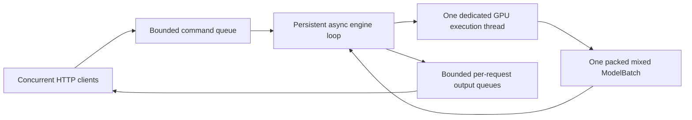

# Persistent GPU serving and profiled KV capacity

## Start and send requests

```bash
uv sync --locked --extra dev
uv run ajvllm-serve \
  --model model/Qwen2.5-0.5B-Instruct \
  --config configs/engine/qwen2.toml \
  --gpu-memory-utilization 0.7
```

The default bind address is `127.0.0.1:8000`. Options also include `--host`, `--port`,
`--device`, `--dtype`, and `--max-pending-requests`. Use one worker/process per GPU
engine; launching multiple workers would duplicate model weights and budgets.
This is a local generation service, not an OpenAI-compatible API.

`POST /generate` accepts exactly one of:

- `messages`: chat messages passed through the checkpoint template with an assistant prefix.
- `prompt`: a raw completion prompt without a chat template.
- `token_ids`: already-tokenized input, checked at engine admission.

Optional fields: `request_id` (otherwise a UUID), `sampling` (SamplingParams fields),
and `stream` (defaults to false). Sampling defaults are the explicit SamplingParams
defaults, not silently inherited from the checkpoint. For reproducible greedy
requests, set `sampling.temperature` to zero.

```bash
curl -N http://127.0.0.1:8000/generate \
  -H 'Content-Type: application/json' \
  -d '{"request_id":"r1","messages":[{"role":"user","content":"Explain GQA in two sentences."}],"sampling":{"max_tokens":64,"temperature":0},"stream":true}'

curl -X DELETE http://127.0.0.1:8000/requests/r1
curl http://127.0.0.1:8000/health
```

Non-streaming responses contain the terminal RequestOutput plus decoded text.
SSE emits one `data:` JSON event per token event, including cumulative token IDs,
new token IDs, cumulative decoded text, status, and a terminal finish reason.
Consumers should replace the displayed cumulative text; individual byte-level
tokens are not necessarily independently decodable. Runtime stream failures use
an `event: error` frame or an output with `finish_reason=error`.

## Persistent loop and concurrency



The loop processes arrivals/cancellations between model iterations, then schedules
one mixed prefill/decode batch, executed in a single model forward. It awaits the dedicated worker without blocking the
HTTP event loop, so new requests can arrive during an in-flight CUDA forward.
When idle it awaits the command queue instead of busy-spinning. Completion of
one workload does not stop the server; subsequent requests wake it again.

Only this loop owns engine state. At most one model forward is in flight. Admission
is FIFO; decodes have scheduling priority and rotate if the current token budget
is smaller than the number of active requests. New requests can join partially
prefilled or decoding requests at the next iteration.

A bounded total request count limits both waiting and running work; full capacity
returns HTTP 429. Invalid input returns 422, and unavailable service returns 503.
Each request also has a bounded output queue. A slow consumer is cancelled and
receives a backpressure error instead of accumulating tokens/KV indefinitely.
SSE disconnect, explicit DELETE, and generator cancellation release the request.
Stream identity prevents cleanup of an old completed stream from cancelling a
new request that reused its ID.

Shutdown enqueues a stop command, waits for the current batch, cancels remaining
requests, drains pending admissions with errors, and releases GPU request state.
A model execution failure terminates the affected batch and leaves unscheduled
requests available. An unrecoverable control/memory failure marks health as 503
and terminates remaining work instead of leaving futures hanging.

## Memory policy

`--gpu-memory-utilization` determines the process memory target used to size the
paged KV pool. Engine limits (`max_num_seqs`, `max_num_batched_tokens`, context,
and prefill caps) remain exactly as configured at startup and during execution.
There is no adaptive budget growth/reduction. If the fixed workload cannot fit,
startup fails with instructions to adjust the configuration; it never silently
reduces concurrency or tokens. Model loading itself precedes profiling.

Startup loads/quantizes/packs weights, then constructs a disposable runner with a
small pool sufficient for the profiling inputs. It executes balanced and
concentrated maximum-prefill shapes, the maximum sampling row count and decode,
including generic CUDA sampling with penalties/masks. The measured allocation
peak includes this temporary pool, so its bytes are subtracted. The temporary
runner and pool are synchronized and released before allocating the final pool.
No CUDA Graph references may survive from the temporary pool: profiling uses
normal forward execution, and graphs are captured lazily with the final pool.

The pool is rounded down to whole blocks using:

```text
workspace = max(measured_peak - temporary_pool - baseline,
                conservative_workspace_bound)
non_KV_peak = baseline + workspace + observed_non_Torch_growth
KV_bytes <= min(total_VRAM * utilization, available_capacity)
            - non_KV_peak - graph_allowance - safety_reserve
```

The safety reserve defaults to 512 MiB. The workspace bound covers unobserved
long-context split-decode/eager attention, mixed-batch shapes, sorting scratch,
and penalty histories of resident requests. Profiling a finite collection of
shapes alone is not a guarantee of the worst possible allocator peak. The memory
target is not a hard CUDA reservation; external allocations can still race startup
or exhaust memory later. An unexpected runtime OOM terminates/releases the affected
batch through normal engine error handling and leaves fixed budgets unchanged.

Omitting `memory.num_blocks` selects this automatic pool sizing. An explicit
value remains useful for controlled comparisons and pressure tests; it must fit
the profiled target and at least one maximum-context request. `max_num_seqs` no
longer multiplies `max_model_len` to determine a paged pool. More sequences can
still increase sampling/history/workspace demand, which profiling accounts for.
The contiguous reference backend uses conservative full-context workspace sizing
and does not allocate a paged pool. Both online and offline CLIs use this startup.

Startup output and `/health.memory` report weights, model buffers, baseline,
measured peak, temporary pool, measured/reserved workspace, non-Torch growth,
graph/safety reserves, final pool and block count, with MiB/GiB display fields.
These are startup measurements; `/health.allocator` reports current allocations.

## Admission and preemption

New requests wait in FIFO order when there are insufficient pages for their
complete known prompt (or recompute history), plus one growth token when possible.
Those pages are reserved at admission, so chunked prefills cannot overcommit the
pool by allocating only their first small chunk. Future `max_tokens` capacity is
not all reserved upfront. Waiting requests do not pin reusable prefix pages.

Running sequences have priority. If they cannot allocate another page as they
grow, emergency recompute preemption remains necessary, even with no new arrivals.
The scheduler does not evict running work merely because a new prompt cannot fit.

An optional conservative short-request policy is enabled by default:

```toml
[engine]
short_request_preemption = true
```

Only the oldest waiter is considered, after at least eight scheduling steps.
A running victim must have a longer cached context and enough exclusively owned
pages to make admission possible. Its remaining output allowance must exceed
`4 * (waiting_known_tokens + waiting_remaining_output) + victim_cached_tokens`.
The last term charges for eventual recompute. Switches are at least 32 steps
apart, and a request can be voluntarily displaced only once; it rejoins the FIFO
queue to protect progress. This heuristic uses `max_tokens` as an upper bound,
not a prediction of EOS, and is not vLLM's default policy. Disable it for pure
FIFO admission plus emergency pressure preemption.

`/health.kv_cache` separates `admission_waits` (failed memory-admission attempts),
`policy_preemptions`, `pressure_preemptions`, and total `preemptions`. Slot-bound
waiting alone does not increment the memory-admission counter. Prefix sharing
and preserved request RNG state continue to work across recompute.

The separation of waiting admission from running-request pressure follows the
[vLLM scheduler design](https://github.com/vllm-project/vllm/blob/main/vllm/v1/core/sched/scheduler.py).
Residual-memory pool sizing follows the
[vLLM worker profiling approach](https://docs.vllm.ai/en/v0.17.1/api/vllm/v1/worker/gpu_worker/).

## Metrics and validation

Memory snapshots include MiB/GiB display fields alongside raw byte counts.
HTTP generation events expose relative durations in `timing`, including numeric
`*_s` values and human-readable seconds. `--profile-steps` enables synchronized
prefill/decode/mixed step measurements plus preparation, model, CUDA sampling,
and compact result transfer times. Sampling always executes on CUDA; no sampling
backend selector is needed.

Default tests use small CUDA models and exclude heavyweight checkpoint fixtures.
Run test files serially. They cover chunking, mixed batching, sampling policies,
request arrival during execution, cancellation, backpressure and HTTP streaming.
`tests/check_local_batch.py` is an optional single-checkpoint numerical check with
contexts of at most eight tokens. The [benchmark workflow](benchmarking.md)
describes reusable datasets, configurable concurrency and comparison methodology.

## Paged KV configuration

Both engine TOML files include this section:

```toml
[memory]
backend = "paged" # "contiguous" selects the comparison backend
block_size = 16
enable_prefix_cache = true
cache_namespace = "local"
# num_blocks = 288 # Optional explicit override; otherwise sized from profiled free capacity.
```

A pool must fit one maximum-context request. Reducing an explicit `num_blocks`
increases admission waiting and may require recompute if running contexts grow
beyond available pages. It does not reduce the padded attention workspace by itself.
Changing these settings requires restarting the server.

`POST /generate` accepts optional `cache_salt` (default empty string). Requests
share complete matching prefixes only within the same model manager, namespace
and salt. Assign salts at a trusted boundary when isolating tenants. Outputs and
partial tails are never blindly reused as prompt logits: at least the last input
token is evaluated. Restart the server to obtain a cold prefix cache.

`/health` includes `kv_cache`: `pool_bytes` is physically allocated CUDA storage,
`used_bytes` counts blocks referenced by requests, and `cached_blocks` counts
indexed reusable prefixes. Idle cached pages may also be free for eviction.
Releasing a request does not shrink the pool, so allocated VRAM can stay constant
across concurrency levels. PyTorch `reserved_bytes` additionally includes reusable
allocator segments and is distinct from all these cache ownership metrics.
Counters expose prefix hits/tokens, evictions, COW copies, preemptions and logical
persistent KV write bytes; these writes exclude temporary attention gathers.

Startup is coordinated by `runtime/inference.py`; `runtime/profiling.py` owns the
disposable production-forward probe. `MemoryBudget` computes capacity and exposes
startup accounting. `KVCacheManager` alone constructs and owns physical storage;
it receives the resolved block count, never a Qwen2 model. Model-specific
workspace bounds live in `execution/capacity.py`.

## Compute backend

```toml
[compute]
backend = "auto" # "eager" for comparisons, "triton" to require native kernels
```

Auto selects Triton for paged FP16/BF16 on SM80+ and head dimensions <=256;
FP32 and contiguous storage use eager by default. Explicit Triton also supports
FP32 for numerical checks. `/health.compute_backend` reports the resolved choice.
The same setting works for offline generation. No per-request model split occurs:
one mixed `ModelBatch` contains both prefill and decode tokens.

Triton JIT compilation happens on first use of a kernel variant. Startup warms
representative prefill/decode, but a new head/dtype/partition variant may still
compile later. Exclude compilation from steady-state measurements by warming the
actual workload, and measure cold-start latency separately when it matters.

## CUDA Graphs and weight quantization

Both optimizations are off by default and are independent:

```toml
[graphs]
enabled = true
batch_sizes = [1, 2, 4, 8]
max_graphs = 8
memory_limit_mb = 128

[quantization]
mode = "w8a16" # "none" keeps original weights
```

Graphs require `[compute] backend = "triton"`, or `auto` resolving to Triton,
and paged KV. One-token sampling-ready batches use bounded batch/context buckets;
other shapes keep the usual mixed Triton forward. The first encounter of a new
bucket warms/captures it, adding cold latency. Cache limits cause ordinary forward
fallback. The graph retention allowance is reserved during startup memory planning;
actual graph pools can raise idle allocated/reserved VRAM. Padding has invalid KV
slots and cannot overwrite active requests' pages.

W8A16 requires CUDA SM80+ and FP16/BF16 model dtype. Conversion quantizes only
decoder projections; embeddings, LM head, norms, activations and KV keep their
original dtype. The full floating model loads before conversion, so quantization
does not yet make an otherwise unloadable checkpoint fit. Restart to change model,
quantization, graph or cache settings; hot conversion with existing graphs/caches
is unsupported. Offline generation uses the same configuration and runtime.

`/health.graphs` exposes captures/replays/fallbacks and a conservative retained-byte
budget; this is distinct from exact allocated or reserved bytes. `/health.quantization`
reports converted layers, weight/scale/activation/KV dtypes and model storage bytes
(including static buffers, excluding KV/graphs/workspaces). The benchmark report
records graph counter deltas and quantization metadata alongside existing metrics.
