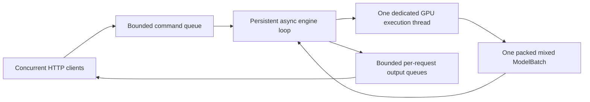

# Persistent GPU serving and adaptive token budgeting

## Start and send requests

```bash
uv sync --locked --extra dev
uv run ajvllm-serve \
  --model model/Qwen2.5-0.5B-Instruct \
  --config configs/engine/qwen2.toml \
  --gpu-memory-utilization 0.7
```

The default bind address is `127.0.0.1:8000`. Options also include `--host`, `--port`,
`--device`, `--dtype`, and `--max-pending-requests`. Use one worker/process per GPU
engine; launching multiple workers would duplicate model weights and budgets.
This is a local generation service, not an OpenAI-compatible API.

`POST /generate` accepts exactly one of:

- `messages`: chat messages passed through the checkpoint template with an assistant prefix.
- `prompt`: a raw completion prompt without a chat template.
- `token_ids`: already-tokenized input, checked at engine admission.

Optional fields: `request_id` (otherwise a UUID), `sampling` (SamplingParams fields),
and `stream` (defaults to false). Sampling defaults are the explicit SamplingParams
defaults, not silently inherited from the checkpoint. For reproducible greedy
requests, set `sampling.temperature` to zero.

```bash
curl -N http://127.0.0.1:8000/generate \
  -H 'Content-Type: application/json' \
  -d '{"request_id":"r1","messages":[{"role":"user","content":"Explain GQA in two sentences."}],"sampling":{"max_tokens":64,"temperature":0},"stream":true}'

curl -X DELETE http://127.0.0.1:8000/requests/r1
curl http://127.0.0.1:8000/health
```

Non-streaming responses contain the terminal RequestOutput plus decoded text.
SSE emits one `data:` JSON event per token event, including cumulative token IDs,
new token IDs, cumulative decoded text, status, and a terminal finish reason.
Consumers should replace the displayed cumulative text; individual byte-level
tokens are not necessarily independently decodable. Runtime stream failures use
an `event: error` frame or an output with `finish_reason=error`.

## Persistent loop and concurrency



The loop processes arrivals/cancellations between model iterations, then schedules
one mixed prefill/decode batch, executed in a single model forward. It awaits the dedicated worker without blocking the
HTTP event loop, so new requests can arrive during an in-flight CUDA forward.
When idle it awaits the command queue instead of busy-spinning. Completion of
one workload does not stop the server; subsequent requests wake it again.

Only this loop owns engine state. At most one model forward is in flight. Admission
is FIFO; decodes have scheduling priority and rotate if the current token budget
is smaller than the number of active requests. New requests can join partially
prefilled or decoding requests at the next iteration.

A bounded total request count limits both waiting and running work; full capacity
returns HTTP 429. Invalid input returns 422, and unavailable service returns 503.
Each request also has a bounded output queue. A slow consumer is cancelled and
receives a backpressure error instead of accumulating tokens/KV indefinitely.
SSE disconnect, explicit DELETE, and generator cancellation release the request.
Stream identity prevents cleanup of an old completed stream from cancelling a
new request that reused its ID.

Shutdown enqueues a stop command, waits for the current batch, cancels remaining
requests, drains pending admissions with errors, and releases GPU request state.
A model execution failure terminates the affected batch and leaves unscheduled
requests available. An unrecoverable control/memory failure marks health as 503
and terminates remaining work instead of leaving futures hanging.

## Memory policy

`gpu_memory_utilization` is a ceiling on this process's GPU memory share, not SM
compute utilization and not a command to fill VRAM. The startup controller uses
CUDA free/total memory and current allocated bytes, subtracts a 512 MiB reserve,
and limits the target to currently available capacity. Existing display/other
process allocations are therefore considered. Model loading itself occurs before
calibration; a model too large to load still fails at load time.

Token budget and KV capacity are distinct constraints. A small decode budget can
still have many long-lived requests consuming KV, so admission also reserves
worst-case cache/workspace space for `max_num_seqs * max_model_len`.

The estimate includes:

- A fixed physical KV pool for the paged backend.
- Triton split-decode partial outputs/LSE, or eager per-layer gather workspace.
- Conservative GQA workspace headroom only for eager attention.
- Three times full-context KV storage only for the contiguous comparison backend.
- Padded attention scores/probabilities only for eager, scaling with `B * heads * Qmax * Kmax`.
- Packed projection/MLP activations and sampling logits.

If the requested capacity does not fit, startup reduces the active sequence cap,
then the token-budget ceiling. It rejects a target that cannot fit even one
full-context request. The resolved configuration is printed so these reductions
are visible. The configured `max_model_len` is never silently shortened.

The server uses TOML `max_num_batched_tokens` as the requested initial budget;
there is no separate startup-budget CLI option. The memory estimate first lowers
it to a safe ceiling. CUDA warmup then records the allocation peak and halves the
budget on OOM or a peak above the target. Runtime starts with the resulting budget.
Every eight successful saturated steps,
it can double the budget if both measured memory and the conservative estimate
leave headroom. It never exceeds the configured/safe ceiling. A low-traffic service
may use far less than the specified fraction; it does not create artificial work
to consume memory.

Startup probes small prefill and decode inputs. The eager memory estimate reserves
mixed-batch attention workspace: every scheduled row can inherit the longest
prefill query and context dimensions. All admitted requests' persistent KV is
still reserved, including when the aggregate prefill token cap is small.

Before each step, the controller rechecks available memory (including PyTorch's
reusable reserved blocks). It reduces budget if needed. High observed peaks reduce
future budgets; an unexpected CUDA OOM fails/releases the affected batch and lowers
the next budget rather than silently replaying potentially advanced state. If even
the minimum budget no longer covers reserved capacity, the service fails clearly.
External GPU allocations can still race these checks; this is a conservative
heuristic, not a hard GPU reservation or a guarantee against every OOM.

`GET /health` exposes target, baseline, warmup peak, observed peak, current budget,
ceiling, and admitted sequence cap. Measurements use PyTorch allocated bytes;
`nvidia-smi` also includes allocator reservations and driver/display allocations.
The configured input-token ceiling remains independent of prompt/output length.
Adaptive budgeting currently requires chunked prefill. The offline CLI uses the same startup calibration and per-step budget adaptation
through `InferenceRuntime`.

The separation of decode priority, chunked prefill, and memory capacity is informed
by [vLLM optimization guidance](https://docs.vllm.ai/en/latest/configuration/optimization/).
The paged estimator accounts for the fixed pool separately from attention workspace.

## Metrics and validation

Memory snapshots include MiB/GiB display fields alongside raw byte counts.
HTTP generation events expose relative durations in `timing`, including numeric
`*_s` values and human-readable seconds. `--profile-steps` enables synchronized
prefill/decode/mixed step measurements plus preparation, model, CUDA sampling,
and compact result transfer times. Sampling always executes on CUDA; no sampling
backend selector is needed.

Default tests use small CUDA models and exclude heavyweight checkpoint fixtures.
Run test files serially. They cover chunking, mixed batching, sampling policies,
request arrival during execution, cancellation, backpressure and HTTP streaming.
`tests/check_local_batch.py` is an optional single-checkpoint numerical check with
contexts of at most eight tokens. The [benchmark workflow](benchmarking.md)
describes reusable datasets, configurable concurrency and comparison methodology.

## Paged KV configuration

Both engine TOML files include this section:

```toml
[memory]
backend = "paged" # "contiguous" selects the comparison backend
block_size = 16
enable_prefix_cache = true
cache_namespace = "local"
# num_blocks = 288 # Optional; otherwise derived from resolved sequence/context capacity.
```

A pool must fit one maximum-context request. Reducing an explicit `num_blocks`
can trigger scheduler preemption and replay; this trades recomputation for a lower
fixed KV allocation. It does not reduce the padded attention workspace by itself.
Changing these settings requires restarting the server.

`POST /generate` accepts optional `cache_salt` (default empty string). Requests
share complete matching prefixes only within the same model manager, namespace
and salt. Assign salts at a trusted boundary when isolating tenants. Outputs and
partial tails are never blindly reused as prompt logits: at least the last input
token is evaluated. Restart the server to obtain a cold prefix cache.

`/health` includes `kv_cache`: `pool_bytes` is physically allocated CUDA storage,
`used_bytes` counts blocks referenced by requests, and `cached_blocks` counts
indexed reusable prefixes. Idle cached pages may also be free for eviction.
Releasing a request does not shrink the pool, so allocated VRAM can stay constant
across concurrency levels. PyTorch `reserved_bytes` additionally includes reusable
allocator segments and is distinct from all these cache ownership metrics.
Counters expose prefix hits/tokens, evictions, COW copies, preemptions and logical
persistent KV write bytes; these writes exclude temporary attention gathers.

Startup is coordinated by `runtime/inference.py`: loaded weights are measured
before capacity resolution and KV allocation. The runner constructs its manager
with resolved capacity, then both cache backends warm up through `runner.execute`.
`MemoryBudget` remains a runtime policy independent of HTTP and Qwen2 internals;
backend-specific workspace estimates live in `execution/capacity.py`.

## Compute backend

```toml
[compute]
backend = "auto" # "eager" for comparisons, "triton" to require native kernels
```

Auto selects Triton for paged FP16/BF16 on SM80+ and head dimensions <=256;
FP32 and contiguous storage use eager by default. Explicit Triton also supports
FP32 for numerical checks. `/health.compute_backend` reports the resolved choice.
The same setting works for offline generation. No per-request model split occurs:
one mixed `ModelBatch` contains both prefill and decode tokens.

Triton JIT compilation happens on first use of a kernel variant. Startup warms
representative prefill/decode, but a new head/dtype/partition variant may still
compile later. Exclude compilation from steady-state measurements by warming the
actual workload, and measure cold-start latency separately when it matters.

## CUDA Graphs and weight quantization

Both optimizations are off by default and are independent:

```toml
[graphs]
enabled = true
batch_sizes = [1, 2, 4, 8]
max_graphs = 8
memory_limit_mb = 128

[quantization]
mode = "w8a16" # "none" keeps original weights
```

Graphs require `[compute] backend = "triton"`, or `auto` resolving to Triton,
and paged KV. One-token sampling-ready batches use bounded batch/context buckets;
other shapes keep the usual mixed Triton forward. The first encounter of a new
bucket warms/captures it, adding cold latency. Cache limits cause ordinary forward
fallback. The graph retention allowance is reserved during startup memory planning;
actual graph pools can raise idle allocated/reserved VRAM. Padding has invalid KV
slots and cannot overwrite active requests' pages.

W8A16 requires CUDA SM80+ and FP16/BF16 model dtype. Conversion quantizes only
decoder projections; embeddings, LM head, norms, activations and KV keep their
original dtype. The full floating model loads before conversion, so quantization
does not yet make an otherwise unloadable checkpoint fit. Restart to change model,
quantization, graph or cache settings; hot conversion with existing graphs/caches
is unsupported. Offline generation uses the same configuration and runtime.

`/health.graphs` exposes captures/replays/fallbacks and a conservative retained-byte
budget; this is distinct from exact allocated or reserved bytes. `/health.quantization`
reports converted layers, weight/scale/activation/KV dtypes and model storage bytes
(including static buffers, excluding KV/graphs/workspaces). The benchmark report
records graph counter deltas and quantization metadata alongside existing metrics.
